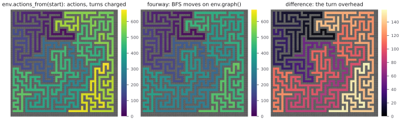
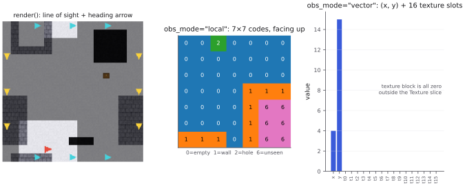
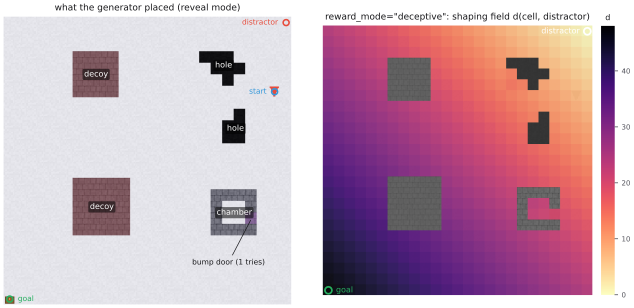
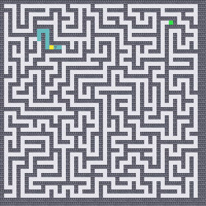
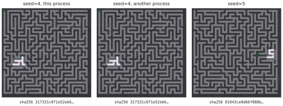
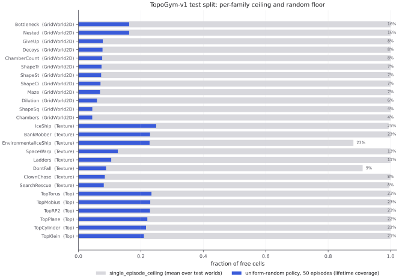
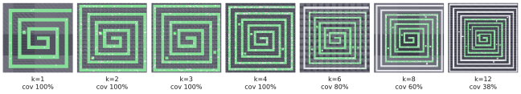
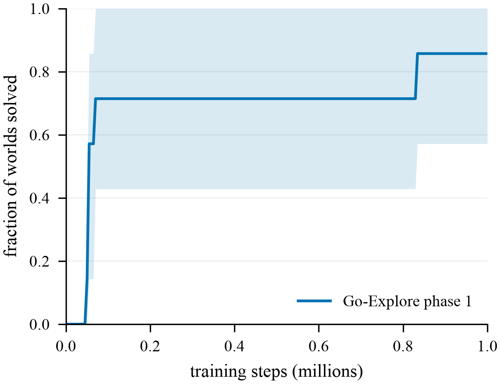
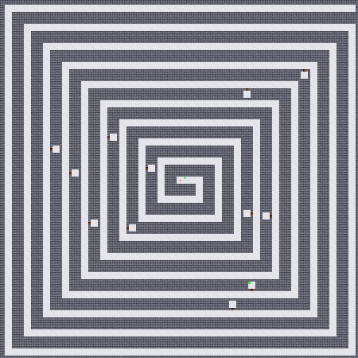

[TopoGym](https://github.com/jcarlson212/TopoGym) is a [Gymnasium](https://gymnasium.farama.org) library of gridworld environments whose shape is known exactly: every world's chambers, decoys, holes, and identifications (the edges of the grid glued into a cylinder, torus, Möbius band, Klein bottle, or projective plane) are certified at generation time by computing the homology of the free-space cell complex with [GUDHI](https://gudhi.inria.fr/) and cross-checking it against the analytic expectation. It is the environment half of my exploration research program; the agent half, TopoExplore, comes later. This post walks through the library's features with visual aids, roughly in the order you would meet them. The two earlier posts on this blog ([basic topology](/blog/basic_topology_and_symmetric_simplexes) and [computing homology](/blog/computing_homology)) are the math background, but nothing here needs more than "$b_1$ counts independent loops."

One note before starting. Every figure below is produced by one script, [`demos.py`](/blog_posts/a_tour_of_topogym/demos.py), which sits next to this post if you want to run or adapt any of it; it uses only the public API of the published wheel (`pip install topogym==0.3.0`, with gymnasium 1.3.0 and gudhi 3.13.0 under Python 3.11) plus matplotlib, pandas, pyarrow, imageio, and networkx for plotting and telemetry — except section 10, whose environment ids and comparison figures are newer than the wheel and need a repository checkout on `PYTHONPATH`. Every number quoted in the text is taken from its output. Almost none of the plotting code is new: worlds are drawn with `topogym.rendering.rgb.render_rgb_2d`, overlays with `tiles.tint`, and the study artifacts in section 10 come straight out of the library's own `plot_single_layout`, `coverage_gifs`, and `write_single_layout_md`.

```python
import gymnasium as gym
import topogym  # registers the TopoGym/* ids
```

## 1. Environments and seeds

Importing `topogym` registers 46 Gymnasium ids. One is the generic `TopoGym/Grid2D-v0`, which takes the generator's configuration directly; the other 45 are the pinned benchmark environments, `TopoGym/{Family}-{size}-v0`, in three slices. GridWorld2D is the structural slice (`Dilution`, `Chambers2`, `ChamberCount`, `Decoys`, `Shape{Sq,Ci,Tr,St}`, `Nested`, `GiveUp`, `Bottleneck`, `Maze`, plus the standalone `EpicChase`), Texture is eight scenarios with semantic local signals (`IceShip`, `EnvironmentalIceShip`, `Ladders`, `BankRobber`, `DontFall`, `SpaceWarp`, `ClownChase`, `SearchRescue`), and Top is the six edge-identification topologies (`TopPlane`, `TopCylinder`, `TopMobius`, `TopTorus`, `TopKlein`, `TopRP2`). Selecting a world is an id and a seed:

```python
env = gym.make("TopoGym/Decoys4-50-v0", seed=3)   # seed = layout seed; omit it for the canonical seed 0
env = gym.make("TopoGym/Grid2D-v0", base="torus", size=17, n_holes=2,
               n_chambers=1, n_decoys=1, layout_seed=7)  # the generic env, configured directly

from topogym.spec import Torus
env = Torus(15).holes(3).chambers(1).compile(seed=7)  # or the fluent spec API
```

The seed is the layout seed: it picks the world, and omitting it gives the canonical specimen the docs picture and the manifest certifies, not a fresh sample per episode (`procedural=True` asks for resampling explicitly). The generic env's configuration is the generator's dataclass, so `base` (`square`, `cylinder`, `torus`, `mobius`, `klein`, `rp2`), `size`, `style` (`rooms`, `maze`, `zigzag`), the feature counts, door kinds, and so on are all keyword arguments.

Those knobs compose, and each one is visible in reveal mode. A style swap plus `braid` turns the generator into a braided maze (each opened loop adds one $H_1$ class); chamber and decoy shapes are swappable per feature; `n_partitions` adds dividing walls crossed by bridge gaps; `door_kind="open"` makes doors visible and walk-through; and `placement_jitter` resamples where the features land, seed by seed, which is how the benchmark turns one configuration into many instances. Texture scenarios come prebuilt with their live semantic block (section 2), and the reward knobs, deception included, attach to any world (section 3).

```python
gym.make("TopoGym/Grid2D-v0", base="square", size=31, style="maze", braid=0.15)
gym.make("TopoGym/Grid2D-v0", size=41, n_chambers=1, n_decoys=3,
         chamber_shape="star", decoy_shape="triangle")
gym.make("TopoGym/Grid2D-v0", size=31, n_chambers=1, n_decoys=2, n_holes=2,
         placement_jitter=4, layout_seed=1)   # same config, features move with the seed
```


![Five worlds rendered with render_rgb_2d in reveal mode, captioned with their certified Betti numbers: the quickstart torus ($b = [1,4,0]$, genus 1; the arrows on its border mark the identified edges), Decoys4-50, Nested3-50, Bottleneck3-100, and TopKlein-50 ($b = [1,2,1]$ over $\mathbb{Z}/2$, $H_1 = \mathbb{Z} + \mathbb{Z}/2$ integrally, demigenus 2).](figures/s01_gallery_light.svg)

Two of the Texture scenarios whose maps change while the episode runs: ClownChase's clowns wander and pay a depleting trickle of reward for approaching them, and EnvironmentalIceShip's bergs grow and shrink with the seasons.


Stepping is ordinary Gymnasium. The default action space is egocentric `Discrete(3)` (turn left, turn right, forward); `actions="fourway"` gives `Discrete(4)` in screen directions. Both come with named constants, and `p_slip=0.1` adds sticky-action noise.

```python
from topogym import TURN_LEFT, TURN_RIGHT, FORWARD            # Discrete(3)
from topogym import MOVE_UP, MOVE_DOWN, MOVE_LEFT, MOVE_RIGHT  # fourway

obs, info = env.reset(seed=0)
obs, reward, terminated, truncated, info = env.step(FORWARD)
```

Episodes truncate at a horizon the world derives for itself: the larger of $1.2 \times$ the side length and three times the turn-aware optimal route to the goal, rounded up to ten (`max_steps=` overrides it). That "turn-aware" is the first place the egocentric action space shows up as a modelling choice rather than a detail. Because the default agent pays for turns, distance is measured in actions, not cells, and the library computes it with a breadth-first search over (cell, facing): `env.actions_from(start)` returns that field for every reachable cell in one search, `env.optimal_actions()` is its value at the goal, and for the fourway agent the natural distance is plain BFS on `env.graph()`, a networkx graph of the free cells.

```python
core = gym.make("TopoGym/Maze-50-v0").unwrapped; core.reset(seed=0)
ego = core.actions_from(core.layout.start)                         # {cell: actions}
fourway = nx.single_source_shortest_path_length(core.graph(), core.layout.start)
ego[core.layout.goal], fourway[core.layout.goal], core.optimal_actions()
# (674, 516, 674)
```



The difference panel is the one to look at. The overhead averages 86 actions over the 1151 cells but is near zero along straight runs and largest in the twistiest corners, because every bend costs a turn. The episode horizon is derived from the egocentric optimum deliberately, so switching to fourway cannot silently shorten an episode, and regret (section 7) is computed against the optimum of whichever action space is in use.

## 2. Observation spaces

The observation is a separate axis from the action space; every combination is legal. There are four modes:

- `local` (default for egocentric): an occluded $7 \times 7$ patch of symbolic codes, centred on the agent and rotated so the agent faces up. Terrain and visibility only; it carries no semantics.
- `dict`: the recommended one. A mapping with three channels kept deliberately apart because they have three different natures: `position` (absolute $(x, y)$, continuous), `patch` (the same occluded code patch, nominal), and `textures` (the 16-slot semantic block for every visible cell, sparse multi-hot, zeroed where occluded).
- `vector` (default for fourway): the spec's universal observation, $(x, y)$ plus the texture block of the current cell only. It carries nothing about the field of view.
- `global`: the whole grid plus an agent mask, unoccluded. An oracle for debugging, not a partial-observability setting.

`dict` is recommended because it keeps two things independently meaningful that the other modes blur. The codes say what a cell physically is (0 empty, 1 wall, 2 hole, 3 open door, 4 goal, 5 out of world, 6 unseen, 7 agent, 8 hazard, 9 wormhole), including the two states a texture slot is never spent on, "out of map" and "not currently visible". The texture slots say what a cell means: slots 0–3 are directional blocker adjacency, slots 4–15 are scenario semantics (`water`, `platform`, `ladder`, `bridge`, `door`, `hallway`, `drop_adjacent`, `ground`, `room_interior`, `on_wormhole`, `clown_near`, `on_treasure`), assigned library-wide so an agent transfers between Texture scenarios, and identically zero on GridWorld2D and Top. The baselines encode the dict with `topogym.baselines.encoders.CellEncoder`, which embeds each cell as the code embedding plus the sum of its active slot embeddings. Here is the observation on a plain world, two animated Texture worlds, and a Top world, each at an informative moment of a short walk:


For comparison, the two non-recommended defaults on the quickstart torus: the egocentric `local` patch (same codes, no textures) and the fourway `vector` observation, which on a GridWorld2D world reduces to $(x, y)$ alone.



That last panel is intentionally boring: a vector-mode agent on GridWorld2D or Top navigates blind, which is exactly why `dict` exists.

## 3. Goals, chambers, decoys, and deception

What is in a world, and how it pays, are both explicit. The generator places four kinds of things: holes (solid obstacles), chambers (enclosed rooms with hidden bump doors that open after a configured number of bumps, `door_tries`; `door_kind="open"` makes them walk-through), decoys (chamber look-alikes that enclose nothing), and the goal, which sits inside a designated chamber so that steps-to-first-reward coincides with steps-to-first-entry. `goal=False` removes it entirely. Reward is chosen with `reward_mode`:

| `reward_mode` | what pays |
|---|---|
| `sparse` (default) | +1 on reaching the goal, which ends the episode |
| `none` | nothing; a pure exploration benchmark, scored by the event metrics of section 7 |
| `coverage` | +1 for every cell visited for the first time |
| `deceptive` | `sparse`, plus a shaping term of 0.01 per unit of graph distance gained towards a distractor cell |

The deceptive mode is the interesting one. The distractor is a free cell far from the goal, the shaping field is the graph distance to it over the free cells, and the agent is paid for closing that distance, so greedy following of the dense reward walks away from the sparse one. `env.deception()` returns the ground truth (the distractor and the full field), so a study can say precisely how deceived an agent was.

```python
env = gym.make("TopoGym/Grid2D-v0", base="square", size=25, n_holes=2,
               n_chambers=1, n_decoys=2, layout_seed=5, reward_mode="deceptive")
obs, info = env.reset(seed=0)
env.unwrapped.deception()["distractor"]      # (24, 0); the goal is at (0, 24)
env.unwrapped.layout.doors                   # {(21, 17): bump door, opens after 1 try}
```



Sixty random steps on this world collected eighteen non-zero rewards summing to −0.08: the shaping is small by design, a gradient rather than a payout. Everything the generator placed is also instrumented: `info["chambers_entered"]` and the per-chamber `chamber_entry_steps`, `info["doors_opened"]`, and the certificate's two readings of the same features, $b = [1,4,0]$ with doors walkable and $[2,5,0]$ sealed (section 8).

## 4. The teleport contract and archives

Archive methods in the style of Go-Explore restart episodes from states they have reached before. TopoGym supports that with `teleport=True` and `env.reset(options={"teleport": cell})`, with one rule: the target has to be a cell visited in some earlier episode on this layout (or be part of a supplied demonstration trajectory). The guard is what stops teleport resets from being free exploration, and it refuses loudly:

```python
env = gym.make("TopoGym/Maze-50-v0", seed=1, teleport=True, max_steps=150)
env.reset(seed=0)
env.reset(options={"teleport": (40, 40)})
# ValueError: teleport target (40, 40) has not been visited in any previous
# episode on this layout, and is not part of the supplied demonstration
```

With the rule in place, a Go-Explore phase-1 loop is a few lines around the library's own archive probe, `GoExploreReset`, which at every episode boundary folds the finished episode into the archive and selects the next start cell by the paper's count-based score:

```python
from topogym.baselines.gridworld2dv1.archive import DEFAULTS
from topogym.baselines.gridworld2dv1.concrete_baselines.goexplore_phase1 import GoExploreReset

probe = GoExploreReset(DEFAULTS, seed=0)
for episode in range(300):
    ...  # random walk until the episode ends
    target = probe(env.unwrapped, info)          # archive update + select
    env.reset(options={"teleport": target})
```



This GIF uses the same `tiles.tint` machinery as the library's coverage GIFs, and it is the honest way to read the discontinuous green jumps in those: the agent did not walk there, the archive dropped it there. Over these 300 episodes the median jump from where one episode ended to where the next began was 11 cells (Manhattan), the largest 38. `info["teleport_start"]` records whether an episode began that way, and `info["lifetime_coverage"]` counts across all episodes on the layout, teleport resets included.

## 5. Homology on the archive, and the tools for looking at it

The library's signature trick is measuring what an agent has discovered from its own trajectory, not from ground truth. There are three layers.

The cheapest is `env.homology_stats("observed")`: the Betti numbers of the region the agent has seen and believes free, recomputed on demand (`"visited"` for cells stood on, `"certified"` for the answer key). `StatsRecorder(track_holes=True)` calls it every step and timestamps the first step at which $h_1 \ge k$ for each $k$. One layer up, `ExplorationTracker` wraps the env, timestamps every first visit and first observation, and treats the whole run as one filtration (cells enter at their discovery step), so the run becomes a persistence problem: an essential bar is a real feature of the world, a finite bar was a belief that died. Here a random egocentric walker explores a $15 \times 15$ torus with two holes, a world with no chambers so the raw and certified counts agree: $b_1 = 2 \cdot 1 + 2 - 1 = 3$.

```python
from topogym.tda import ExplorationTracker
tracker = ExplorationTracker(gym.make("TopoGym/Grid2D-v0", base="torus", size=15, n_holes=2,
                                      n_chambers=0, n_decoys=0, reward_mode="none",
                                      max_steps=1500, layout_seed=3))
rec = StatsRecorder(tracker, track_holes=True)
rec.reset(seed=0)
for _ in range(1500):
    rec.step(int(rng.integers(3)))
rec.hole_steps[1]                 # {1: 117, 2: 131, 3: 175, 4: 230}
tracker.discovery_diagram()[1]    # [(117, inf), (131, inf), (175, inf), (230, 261)]
tracker.summary()                 # essential_bars {0: 1, 1: 3}, transient_bars {1: 1}, recovery step 175
```

![Top left: the H1 of the observed region versus step for a random walk, stepping up to 1 at step 117, 2 at 131, 3 at 175, overshooting to 4 at step 230 and settling back on the certified value of 3. Top right: the tracker's discovery diagram in dimension 1, three essential bars and one finite bar from 230 to 261. Bottom: the known region at each of the four discovery steps — unseen cells dimmed blue-grey (they are not walls; walls stay black), visited cells green, the class that was just born highlighted in yellow — a shortest wrap cycle when the seen band closes around the torus, tight rings around the enclosed regions otherwise — and enclosed-but-unseen cells red.](figures/s05_discovery_light.svg)

It is worth being precise about where the four classes live, because only two of them are visible as holes at all. The complex is built from the cells the agent has seen and believes free; walls are never in it, and neither are unseen cells, so both kinds of absence can be enclosed. The snapshots highlight the class that was just born, so each one can be pointed at. The first two, born at steps 117 and 131, do not go around anything missing: they are the torus's own loops, and their yellow cycles visibly run off one edge of the picture and back in through the identified edge on the other side (the border arrows mark the gluing) — a band of seen cells has closed around each direction of the quotient, and no amount of filling holes would remove these classes. The third bar, at step 175, is the first one that looks like a hole: the seen region now encloses both obstacles (black, with their still-unseen fringes in red), and enclosing them adds exactly one class rather than two because on a closed surface the two obstacle rings are homologous — the sum of all puncture boundaries is null-homologous, which is the $k - 1$ in $b_1 = 2g + k - 1$. The fourth bar, at step 230, is the small ring around a single red cell: a free cell the agent has walked entirely around but never seen into. From outside it is indistinguishable from a one-cell obstacle, so the complex honestly reports a fourth hole; at step 261 the agent sees it, it joins the region, and the class dies. An obstacle's interior can never do that — it will never be believed free — which is what separates the three essential bars from the transient one. That is why the tracker reports discovery steps for $h_1 \ge k$ rather than "found hole $k$": the observed filtration is a belief. (The visited region's own $b_1$ is not the thing to plot here; a random walk's trail is a thin skeleton full of small loops, and `visited_betti()` ends this run at 10.)

The third layer is `VisitedComplex`, the data structure for agents that want to consume topology rather than be scored by it. Feed it the states you have visited (seeded from the archive with `from_env`, then `add` as you go) and read back the shape of what you know: `betti()`, `representatives()` (one closed loop of visited cells per $H_1$ class, every cell an archive-restorable state), `rims()` (for each enclosed pocket, the innermost visited loop around it and the part of that loop adjacent to seen-but-unvisited cells, i.e. where it can still tighten), and `torsion()` for an offline integer check. How the topology is computed is itself a knob, at two levels. `VisitedComplex` takes a `backend`: `cubical` (the default, movement-consistent because it is built on the env's own glued grid), `vr` (a Vietoris–Rips complex at any $\varepsilon$ — over cell coordinates, or over any point cloud you hand it, such as your encoder's latent vectors, with a `metric` of your choosing), and `witness` (de Silva–Carlsson landmarks, for holding a large archive at a fixed budget, with the admit/evict policy overridable). Coefficients are any prime field or $\mathbb{Z}$, and with $\mathbb{Z}$ an offline `torsion()` runs an integer Smith normal form. On the archive above the backends agree where they should and diverge where that is the point:

```python
VisitedComplex.from_env(env).betti()                             # cubical: (1, 4)
VisitedComplex.from_env(env, backend="vr", epsilon=1.5).betti()  # (1, 4) — same answer
VisitedComplex("vr", epsilon=1.5).add(latent_vectors).betti()    # any point cloud, no env needed
VisitedComplex.from_env(env, backend="witness").betti()          # (1, 1) — landmarks keep the coarse structure
VisitedComplex.from_env(env, coefficients="Z").torsion()         # integral, for the non-orientable bases
```

The environment's own computations have the same switch: `gym.make(..., complex="rips")` swaps the backend that `homology_stats`, `observed_betti`, and `free_betti` run on from the cubical complex to a Vietoris–Rips complex on the quotient metric, which is the setting to reach for when the thing being explored stops being a grid. The same loops are what the env itself exposes as `env.h1_representatives()`, and what the live overlay draws during keyboard play (`pip install "topogym[play]"`, `python scripts/play.py TopoGym/Nested3-50-v0`, with `TOPOGYM_OVERLAY=1`: representative cycles in yellow, rims in green, and a live $H_1$ count). Here, after 3000 fourway random steps on Nested3-50:

```python
from topogym.tda import VisitedComplex
vc = VisitedComplex.from_env(env)                  # seeded with the archive cells
vc.betti()                                         # (1, 4)
[len(loop) for loop in vc.representatives()]       # [40, 48, 30, 80]
vc.rims(observed=env.unwrapped._observed_free)     # 4 pockets; innermost cycles of 8, 12, 16, 14 cells
len(env.unwrapped.h1_representatives())            # 4
```


The two panels are the same walk read in the two spaces, and the difference is the use-case. The seen space is the agent's belief about the world: its holes converge to the certified classes, and the tracker's diagram above is its history, scored in hindsight — an evaluation instrument rather than a control signal, because a bar can only be labelled transient after it dies. The archive space is the set of states a teleport reset can actually restore, so its holes mean something else entirely: Nested3-50's certified $b_1$ is 0 with doors walkable, and these four classes are not features of the world but pockets of floor the agent has walked around without entering. That is exactly what an archive method wants to know. Each yellow cycle is a closed walk of restorable cells, and each red rim is the stretch of it adjacent to seen-but-unvisited floor — a frontier to push, or in Go-Explore terms, the cells worth selecting next. The whole computation took 0.02 s at this size; it is lazy and cached but not incremental, so query it once an episode rather than once a step.

## 6. Curvature reads structure

`env.ollivier_ricci()` returns the Ollivier-Ricci curvature of every free cell (mean over incident edges, $\alpha = 0$, exact $W_1$), computed once and cached on the layout. On a grid the interior is flat, so the field is a detector for the places where the free-cell graph is locally thin: doorways, corridors, bottlenecks. On Bottleneck3-100 it takes 0.8 s for 3471 cells, and 1.0% of them are negative; `env.bottlenecks()`, the purely combinatorial width-one passage detector, finds 15 cells on the same world.

```python
core = gym.make("TopoGym/Bottleneck3-100-v0").unwrapped; core.reset(seed=0)
ricci = core.ollivier_ricci()                    # {cell: kappa}, min -0.29, max 0.0
rec = StatsRecorder(gym.make("TopoGym/Bottleneck3-100-v0"), track_curvature=True)
# ... 5 random episodes ...
rec.metrics().curvature_coverage_below_zero      # 0.0
rec.metrics().state_coverage                     # 0.085
```


The derived metric is the one line that matters for exploration research: `curvature_coverage_below_zero` is the fraction of negatively curved cells the agent has ever stood on, in other words "did the explorer find the hard geometry?" Five random episodes on this world reach 8.5% of the cells and 0% of the doorways, which is a sharper statement of what random exploration fails at than the coverage number alone.

## 7. Metrics

Two levels of instrumentation come for free. The env's `info` dict carries the live state every step, and `StatsRecorder`, a Gymnasium wrapper, accumulates per-episode rows (and per-step rows with `record_steps=True`) and reduces them to a frozen `Metrics` object. What `info` gives:

| key | meaning |
|---|---|
| `position`, `steps`, `episode_return` | where the agent is, how long the episode has run, return so far |
| `goal_reached` | whether this step reached the goal |
| `coverage`, `lifetime_coverage` | fraction of free cells visited this episode / across all episodes on the layout |
| `observed_frac`, `known_components`, `h0_merges` | fraction of free cells seen, pieces of the known region, times two pieces joined (maintained incrementally, no GUDHI) |
| `chambers_entered`, `doors_opened` | how many distinct chambers entered, doors opened |
| `teleport_start` | whether the episode began at an archive cell |
| `topology` (at reset) | the certificate of section 8, as a dict |

What `StatsRecorder` records per episode: `length`, `return`, `coverage`, `lifetime_coverage`, `chambers_entered` with `chamber_entry_steps`, `doors_opened`, `h0_merges`, `goal_reached`, `teleport_start`, `unique_states`, `steps_to_success`, `optimal_steps` (of the action space in use), `regret`, `coverage_milestones`, and `visitation_entropy`; per step: `reward`, `coverage`, `lifetime_coverage`, `chambers_entered`. And what `metrics()` reduces them to:

| `Metrics` field | meaning |
|---|---|
| `success_rate`, `interactions_to_first_success` | fraction of episodes reaching the goal; global step of the first success |
| `unique_states`, `state_coverage` | lifetime cells visited, as a count and a fraction |
| `visitation_entropy`, `visitation_entropy_normalized` | Shannon entropy of the lifetime visitation distribution; divided by $\log_2 n_{\text{free}}$ |
| `mean_regret`, `planning_efficiency` | mean (steps to goal − optimum) over successes; mean optimum/steps over successes after the first |
| `steps_to_coverage` | global step at which lifetime coverage first reached 50, 60, 70, 80, 90, 95, 99, 100% |
| `steps_to_h0_holes`, `steps_to_h1_holes` | with `track_holes=True`: global step the observed region first had $h_d \ge k$ |
| `mean_episode_coverage` | mean final coverage per episode |
| `curvature_coverage_below_zero` | with `track_curvature=True`: section 6's metric |

Rows are plain dicts, so the whole thing lands in pandas, and from there in Parquet, in one line each. Thirty random fourway episodes on Decoys4-50:

```python
rec = StatsRecorder(gym.make("TopoGym/Decoys4-50-v0", seed=1, actions="fourway",
                             max_steps=1500), record_steps=True)
# ... 30 episodes ...
m = rec.metrics()
pd.DataFrame(rec.episodes).to_parquet("episodes.parquet")   # 30 rows, 11.6 kB
pd.DataFrame(rec.steps).to_parquet("steps.parquet")         # 44,863 rows, 361 kB
```

```text
Metrics(episodes=30, success_rate=0.067, interactions_to_first_success=7382,
        unique_states=1826, state_coverage=0.824,
        visitation_entropy=9.81, visitation_entropy_normalized=0.883,
        mean_regret=1367.5, planning_efficiency=0.043,
        steps_to_coverage={0.5: 11754, 0.6: 23673, 0.7: 25160, 0.8: 41788},
        mean_episode_coverage=0.169, ...)
```


The random walker reached the goal twice in thirty episodes, both times on its way out of a 1300-step wander, so the regret is enormous and `planning_efficiency` is 0.04; that is the number a learned policy should move towards 1. `rec.save(path)` writes the run as JSON with a header (the canonical run key, library version, topology, horizon), the rows, and the metrics, with no timestamps, so the file is a pure function of the run. The benchmark harness's `TelemetryWriter` writes the same kind of per-step and per-episode tables as Parquet directly, with algorithm, split, and instance keys attached; section 10 reads them back.

## 8. Certified topology

Every env carries a `TopologyMetadata` record, `env.unwrapped.topology`, also delivered as `info["topology"]` at reset. On the quickstart torus:

```python
env = gym.make("TopoGym/Grid2D-v0", base="torus", size=17, n_holes=2,
               n_chambers=1, n_decoys=1, layout_seed=7)
obs, info = env.reset(seed=0)
topo = info["topology"]
```

| field | value here | meaning |
|---|---|---|
| `base_map`, `size`, `style`, `layout_seed` | `torus`, (17, 17), `rooms`, 7 | what was generated |
| `n_holes`, `n_chambers`, `n_decoys`, `door_tries` | 2, 1, 1, (4,) | the features, and bumps per door |
| `n_cells`, `n_free_cells` | 289, 219 | grid and free space |
| `betti_z2` | [1, 4, 0] | $\mathbb{Z}/2$ Betti numbers, doors walkable |
| `betti_z2_sealed` | [2, 5, 0] | the same, doors counted as walls |
| `homology` | H0 = Z, H1 = Z^4, H2 = 0 | integral groups, as strings |
| `euler_characteristic`, `orientable`, `genus`, `demigenus` | −3, true, 1, — | surface invariants of the free space |
| `betti_q`, `h1_torsion`, `n_boundary_components` | (1, 4, 0), (), 3 | rational Betti numbers, torsion, boundary components |
| `connectivity` | 2 bridges, 3 articulation points, 3 biconnected components | how bottlenecked the free-cell graph is |
| `certified` | all true | which fields were cross-checked against the analytic expectation |

The hook is the last row: these numbers are not estimates. At generation the library builds the cubical complex of the free cells, hands it to GUDHI, and compares the result with what the generator expected from the features it placed; a world whose computed and expected Betti numbers disagree is thrown away and regenerated. It is worth being precise about which reading is which, because I got it wrong on first reading. The headline `betti_z2` is the doors-walkable reading: a doored chamber is a room, not a hole, so its wall footprint is filled in before computing. That leaves three punctures in the torus (two holes and the decoy), and a closed orientable surface of genus $g$ with $k$ disks removed has $\chi = 2 - 2g - k$ and $b_1 = 2g + k - 1$: here $\chi = -3$ and $b_1 = 4$, matching the certificate. The sealed reading counts doors as walls: the chamber interior becomes its own component ($b_0 = 2$) and its wall becomes a closed ring that blocks one more loop ($b_1 = 5$). A third number, not in the certificate, is what an agent actually walks through: the raw free space with the chamber wall standing and the door passable, which has $b_1 = 5$ (`env.unwrapped.free_betti()` returns `(1, 5, 0)` on this world). The observed-region homology of section 5 converges to that raw count, which equals the headline count exactly when a world has no doored chambers.

Two details from the gallery in section 1 are worth a second look. Nested3-50 has $b_1 = 0$ with doors walkable but $b_0 = 5$, $b_1 = 4$ sealed: three nested shells, each a room once you are through its door, each a wall if you are not. And TopKlein-50 is a full Klein bottle with no obstacles at all, so its $\mathbb{Z}/2$ Betti numbers are $(1, 2, 1)$ while its integral $H_1$ is $\mathbb{Z} \oplus \mathbb{Z}/2$; the certificate carries both, plus the demigenus, because a compact surface's integral homology is determined by its $\mathbb{Z}/2$ data and orientability. Across the registry, `topogym.registry.manifest()` emits one row per id with its canonical configuration string (the run-log key, e.g. `TG-GridWorld2D-S50-C1-D4-cs8-ds8-sep2-shpSq-ctr-ring-bl-open-slip0-seed0` for Decoys4-50), validity, and certified topology; the same content is published as `docs/manifest.csv` and, for the datasets crowd, as `croissant.json`, an MLCommons Croissant 1.0 description of TopoGym-v1 with one record per environment id and one record set per split.

## 9. Determinism and the benchmark splits

Every registered id is pinned: `(config, seed)` fixes the layout and all of its metadata byte for byte, including everything computed through GUDHI, and iteration orders are sorted so nothing depends on interpreter hash state. The cheapest way to make that claim visceral is to render the same world from two different interpreters and hash the pixels. The middle panel below was rendered by a child process started with `subprocess.run([sys.executable, "-c", ...])`; the left one in the main process.

```python
env = gym.make("TopoGym/Maze-50-v0", seed=4); env.reset(seed=0)
img = render_rgb_2d(env.unwrapped, tile=6)
hashlib.sha256(img.tobytes()).hexdigest()
# 317331c071e52eb615ce4bf4ce0b824b0cf3fde4780c1c2702f9f79b9ec948d4  (this process)
# 317331c071e52eb615ce4bf4ce0b824b0cf3fde4780c1c2702f9f79b9ec948d4  (another process)
# 01043ce0d66f888beb2a6e8405250e855208cdb2e94b9ca97ae89cbcf1a4f084  (seed=5)
```



The same contract covers episodes: `(env, reset seed, actions)` fixes the trajectory, `p_slip` included. The practical consequence is that a benchmark row is the world, not a recipe for one, which is what makes the published splits usable by anyone. TopoGym-v1 is a frozen roster of 23 families across the three slices (`topogym/benchmarks.json`, the sole authority on membership), with tune, train, val, and test splits that contain the same 63 family-size units and differ only in which seeds they draw, from disjoint bands (tune 1000+, train 2000+, val 3000+, test 4000+, with the canonical seed 0 in none of them). The CSVs live in the repository's `docs/splits/`, and `load_split` reads them; the wheel does not ship them, so outside a checkout pass `path=` pointing at one.

```python
from topogym import benchmarks
from topogym.baselines.gridworld2dv1.instances import load_split, make_instance
from topogym.baselines.gridworld2dv1.single_layout import single_episode_ceiling

rows = load_split("test", path=Path("TopoGym/docs/splits"))      # 189 rows
benchmarks.benchmark()["title"], benchmarks.benchmark()["frozen"]  # 'TopoGym GridWorld2D v1', True
env = make_instance(rows[0])                                       # teleport-enabled, flattened obs
single_episode_ceiling(rows[0]["template_id"], int(rows[0]["seed"]), row=rows[0])
```

Each row records its canonical config, certified Betti numbers in both conventions, turn-aware optimal route, and horizon, so the difficulty distribution of a split is auditable rather than asserted. `single_episode_ceiling` is the honest denominator: the fraction of a world that one episode from the start can reach at all, which bounds the coverage of any method that never takes an archive reset. The figure overlays it, per family, with the random floor: a uniform-random policy run for 50 episodes on every test world, which is the library's published protocol, and it reproduces the published pooled number (10.98% coverage here against 11.0%, with 0% of episodes reaching the goal).



The ceiling is 1.0 on almost every test world, which is the intended design: the horizons are set so the goal is reachable with room to wander, and what separates methods is how much of a reachable world they actually uncover. The ceiling bites on the Texture families whose mechanics close parts of the map and, far more sharply, on the standalone EpicChase family, which is the next section.

## 10. Complete single-layout studies: the EpicChase sweep

The benchmark asks whether a policy transfers: hyperparameters on `tune`, gradients on `train`, early stopping on `val`, `test` read once at the end, enforced by `Baseline.run()`. A single-layout study asks the other question an explorer cares about: given a budget of steps in this one world, how much of it do you uncover, and do you ever reach the goal? Both run through the same small abstraction, which is what every baseline implements; in pseudo-code:

```python
class Baseline:
    name: str
    actions = "egocentric"        # declared once; used identically in training and evaluation
    obs_mode = None               # None follows the action mode; "dict" or "vector" to insist
    reward_mode = None            # None is the env default (sparse)
    tune_grid = ()                # candidate hyperparameter settings; the first is the default
    tuning_splits = ("tune",)     # which splits selection may read; never test
    adapts_per_instance = False   # True only for methods that learn inside a hold-out world

    def fit(self, train_rows, val_rows, hyperparameters) -> TrainingReport: ...
    def policy(self) -> Callable[[obs, env], int]: ...          # the frozen result of fit
    def select_hyperparameters(self, tuning) -> Hyperparameters: ...   # optional; default declines
    def choose_reset(self, env, info) -> cell | None: ...        # episode-boundary probe (archives)
    def env_options(self) -> dict: ...                           # extra kwargs for make_instance
    def run(self, splits) -> BaselineResult: ...                 # tune -> train -> val -> test
    def single_layout_train_test_run(self, row, **budget) -> SingleLayoutResult: ...
```

`RandomBaseline` implements `fit` as a no-op and `policy` as uniform actions; `GoExplorePhase1Baseline` implements `choose_reset` with the archive of section 4, declares `tuning_splits = ("tune", "train", "val")` because it fits a selection strategy rather than a policy, and carries a sixteen-point `tune_grid` over the paper's weights; the PPO family subclasses `PPOBaseline` and a variant such as RND or ICM overrides one hook, and Go-Explore's phase 2 (`go-explore-phase1and2`) is a `PPOBaseline` whose episodes start from the archive's best trajectories.

The study here is the EpicChase family, which exists to exhibit a scaling law: k chambers sit a full episode apart along one spiral corridor, so no single episode from the start can reach the goal, and entering all k of them is a conjunction of k independent-ish events. The registry carries it as a sweep, $k \in \{1, 2, 3, 4, 6, 8, 12\}$, because two points cannot show a curve. I ran `random` and `go-explore-phase1` on every world at the published benchmark budget — one million environment steps of learning, then twenty frozen evaluation episodes — which is `single_layout_train_test_run` in a loop:

```python
for k, size in ((1, 60), (2, 70), (3, 70), (4, 90), (6, 110), (8, 120), (12, 150)):
    row = layout_row(f"TopoGym/EpicChase{k}-{size}-v0", seed=0)
    for cls in (RandomBaseline, GoExplorePhase1Baseline):
        result = cls(BaselineConfig(seed=0)).single_layout_train_test_run(
            row, step_budget=1_000_000, eval_episodes=20,
            telemetry_root=f"study/{row['unit']}/telemetry", step_stride=100)
    plot_single_layout("study", row["unit"]); coverage_gifs("study", row["unit"])
    write_single_layout_md("study", row["unit"])
plot_solve_profile("study", ["go-explore-phase1"], budget=1_000_000)  # topogym...comparison
```

The whole sweep is about fifteen minutes on a laptop: a million steps of Go-Explore phase 1 takes 105 s on the smallest world and 163 s on the largest, and random has no training phase, so its studies are seconds. What falls out:








Three things in these artifacts are worth reading closely, because they are the harness being honest rather than broken. First, the coverage curve sits far above the ceiling at every k — 60% against 10.4% at k = 8 — which is proof that the archive carried the agent where no restart-from-start method can go; random, for its part, never reaches a goal anywhere in the sweep. Second, the right-hand panel is the scaling law the family was built for: time-to-first-solve is flat while the archive can chain the chambers within its budget, then jumps an order of magnitude at k = 8 and falls off the top of the plot at k = 12, which is what "a conjunction of k events" looks like on a log axis. Third, each world's `SUMMARY.md` scores the frozen evaluation identically for both methods: evaluation runs the policy in a fresh world without the archive, and phase 1 of Go-Explore has no policy, only an archive, so at evaluation it is the random walker. The thing phase 1 produces is the archive and the coverage curve; turning them into a policy is phase 2, which is why the baseline's name says which half it is.

## 11. Future work

Three directions, in the order I expect to take them.

- Three-dimensional gridworlds. The core already distinguishes `DIM` 2 from 3 (a 3D view radius, `h2` and `h3` slots in `HomologyStats`), and GUDHI's cubical complexes do not care about the dimension; what is missing is the generator, the bases, and the certified families. The interesting new objects are enclosed voids, $H_2$, which have no 2D analogue.
- Continuous spaces. The TDA side is further along than the environment side: `VisitedComplex`'s Vietoris–Rips and witness backends already take point clouds and encoder vectors rather than cells, which is the representation a continuous or latent-space agent would feed them. The environments themselves, and what "certified" means when the free space is not a cell complex, are open.
- A C++ core for the environments. Stepping is the bottleneck for every baseline (the policy is a small MLP over a 49-dimensional vector), and the Python core runs on the order of 100K steps per second; the target for a C++ core behind the same Gymnasium interface is 1M steps per second, with determinism up to seeds preserved across the rewrite.

Everything above is reproducible from `demos.py`, down to the hashes in section 9; that, after all, was the point of section 9.

## References

1. J. Carlson. TopoGym: Environments and Benchmarks for Topological Exploration in Reinforcement Learning, version 0.3.0, 2026. [github.com/jcarlson212/TopoGym](https://github.com/jcarlson212/TopoGym), [pypi.org/project/topogym](https://pypi.org/project/topogym/).
2. A. Ecoffet, J. Huizinga, J. Lehman, K. O. Stanley, J. Clune. Go-Explore: a New Approach for Hard-Exploration Problems. arXiv:1901.10995, 2019.
3. Y. Ollivier. Ricci curvature of Markov chains on metric spaces. Journal of Functional Analysis 256(3), 2009.
4. M. Towers et al. Gymnasium: A Standard Interface for Reinforcement Learning Environments. arXiv:2407.17032, 2024.
5. The GUDHI Project. GUDHI User and Reference Manual, 3.13. [gudhi.inria.fr](https://gudhi.inria.fr/).
6. MLCommons. Croissant: a metadata format for ML-ready datasets, 1.0. [mlcommons.org/croissant](https://mlcommons.org/croissant/).
