Background assumed: we assume knowledge of basic set theory, linear algebra, and the definition of a group typically taught in undergraduate Computer Science programs. Some familiarity with what an Markov Decision Process (MDP) environment would look like in a 2D grid world would also help with understanding how exploration within a grid world translates to a controller learning from its environment through algorithms like PPO. Familiarity with point set topology would help make the ideas easier to digest – we do sometimes reference geometric spaces / other examples that would be obscure to a typical computer scientist, but these references are meant to be supplementary for readers with an additional background in introductory topology rather than core to understanding the key concepts.

First, let's start with why we would even care about studying topology and simplexes in the first place. Well, to start they help us compute structures that are invariant under continuous deformation... who cares? Well, a few topological data analysts do (growing), because by being invariant under continuous deformation these topological features tend to be very robust — far more robust than detecting whether there's a car, a bat, a plane, etc. in some environment.

What do I mean by robust? A common example of a robust feature is the median – it's statistical robustness comes from being less sensitive to unbounded variance along the extremes of the distribution of points, but it is not robust to a large interior burst of noise from many points. On the other hand, Homological features, a type of topological feature often related to the appearance of holes in the environment, are robust to pertubations in the environment through some bounded amount of noise (the features still exist) so long as the number of holes are finite – hence an interior "burst" of noise they remain invariant under. By burst of noise I really just mean if you jiggle all of the points you measured by some random amount of distance within a bounded range these homological features would still exist. Thus, we can count on finding them, and rely on them for fundamental early exploration in learning algorithms.

So now that you might have some sense that these features are stable, what can they actually be used for? They can be used for early navigation, similar to the maps that got explorers over from Spain, Portugal, France, and England to the new world after the first wave. The maps were wildly off in terms of metric distance, but topologically (the general shape of islands or rivers penetrating the continent) were correct (hard to be off topologically when drawing a map – you'd have to believe a daydream of discovering a new island in the middle of the sea or a river cutting through a land mass).

Concretely, this post is building towards the following example: an agent exploring a gridworld with a chamber it has never been inside. The agent's cloud of visited states wraps around that chamber, and that wrapping is a hole — a feature we can compute directly from the visited states. The hole tells us there's a pocket our exploration missed, and it traces the ring of states surrounding it, which is exactly where to look for an entrance if one exists. The same idea extends well past gridworlds: in search and rescue, a person trapped inside a large amount of shrapnel behind a narrow passage shows up the same way — the searched space wraps around an unsearched void, and the hole both flags the void and localizes where a way in would have to be.

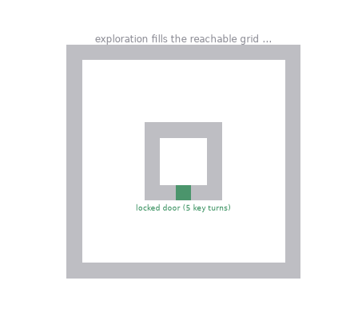

In this blog post we will go over basic definitions in topology with examples, the Čech complex, the Vietoris–Rips complex, the nerve lemma, and the sandwich theorem. These theorems develop the machinery for the example above and much more, and we will return to it in full detail at the end.

## Topologies and open sets

A *topology* on a set $X$ is a collection $\tau$ of subsets of $X$ — called the *open sets* — satisfying three axioms:

1. $\emptyset \in \tau$ and $X \in \tau$,
2. any arbitrary (possibly uncountably infinite) union of open sets is open,
3. any *finite* intersection of open sets is open.

We call the pairing of $X$ with its topology $T$, $(X, T)$, a topological space. A space in general is a way of alluding to a set having some mathematically structure attached to it that defines relationships between the points in the set. The example that matters for us is the *standard topology* on $\mathbb{R}^n$: a set is open if around every one of its points you can fit an open ball

$$
B(x, r) = \{ y \in \mathbb{R}^n : \|y - x\| < r \}
$$

that stays inside the set. The strict inequality is the point — an open ball does not contain its boundary, and open sets have no boundary points of their own. Unions of open balls give you every open set in $\mathbb{R}^n$, so the balls *generate* the topology:

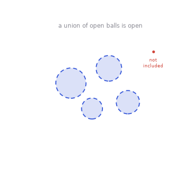

Two degenerate examples to calibrate the definition: the *discrete topology*, where every subset is open (take $\tau$ to be the whole power set), and the *trivial topology*, where only $\emptyset$ and $X$ are. Both satisfy the axioms; neither is interesting geometrically. And one construction we'll use implicitly throughout: any subset $A \subseteq X$ inherits a *subspace topology* — its open sets are $U \cap A$ for $U$ open in $X$. That's how a circle sitting inside $\mathbb{R}^2$ gets its topology from intersecting unions of open balls with it.

A map $f : X \to Y$ between topological spaces is *continuous* if $f^{-1}(V)$ is open in $X$ for every open $V$ in $Y$. For metric spaces like $\mathbb{R}^{n}$ this is the usual $\varepsilon$–$\delta$ w/ a bit of abstract overhead.

## Homeomorphisms

A *homeomorphism* is a continuous bijection $f : X \to Y$ whose inverse is also continuous. If one exists, $X$ and $Y$ are topologically the same space — the open sets correspond perfectly, so any property expressible in terms of open sets transfers.

This is the "rubber sheet" notion of equivalence: one can stretch and bend, but not tear or glue without breaking the original topological structure. A wobbly blob and a round disk for instance are homeomorphic:

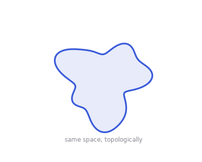

Holes are the classic obstruction as one can't simply deform a space with a hole to one without (the forward map) without the inverse having to discontinuously separate two points to recreate the original space's hole. For example, a disk is not homeomorphic to an annulus (the result of removing a smaller disk from the interior of a larger disk): the annulus has a hole and the disk doesn't, and — once we've built the machinery below — that difference is controlled by an invariant, so no homeomorphism can exist.

Even if spaces have the *same-looking* holes they can still fail to be homeomorphic. The circle $S^1$, the annulus, the cylinder, and the Möbius band each have "one loop's worth" of hole — every one of them wraps around a single hole in the same essential way. But no two are homeomorphic: the circle is 1-dimensional while the others are 2-dimensional; the cylinder's boundary is two circles while the Möbius band's boundary is one. While they have the same hole structure, one can see that they can't be continuously deformed in the case of $S^{1}$ and the cylinder because high dimensions collapse onto a line, breaking continuity in the inverse (a collapse in dimensionality is far stronger than a simple stretch w.r.t. infinitesimal locality captured by open balls that can always be found around a point for subspaces of euclidean space). This mismatch is exactly what the next definition is for.

## Homotopy equivalence

Two continuous maps $f, g : X \to Y$ are *homotopic* ($f \simeq g$) if one deforms continuously into the other: there is a continuous

$$
H : X \times [0,1] \to Y, \qquad H(\cdot, 0) = f, \quad H(\cdot, 1) = g.
$$

Two spaces are homotopy equivalent ($X \simeq Y$) if there are maps $f : X \to Y$ and $g : Y \to X$ with $g \circ f \simeq \mathrm{id}_X$ and $f \circ g \simeq \mathrm{id}_Y$. Notice that for homeomorphism we demand $g \circ f = \mathrm{id}_X$, whereas homotopy equivalence only requires that $g \circ f$ is homotopic to $\mathrm{id}_X$.

A nice example of this concept: the punctured plane $\mathbb{R}^2 \setminus \{0\}$ is homotopy equivalent to the circle. Take $f : \mathbb{R}^2 \setminus \{0\} \to S^1$, $f(x) = x / \|x\|$, and let $g$ be the inclusion of the circle. Then $f \circ g = \mathrm{id}_{S^1}$ exactly, and $g \circ f \simeq \mathrm{id}$ via $H(x, t) = (1-t)\,x + t\,x/\|x\|$, which slides every point radially onto the circle:

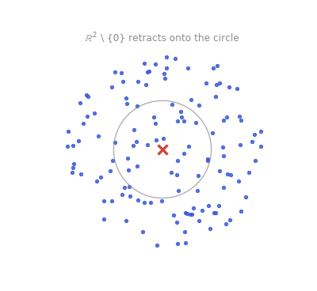

The same argument shows the annulus, the cylinder, and (with a little more care) the Möbius band are all homotopy equivalent to $S^1$ — resolving the tension from the last section. They aren't homeomorphic, but they carry identical hole structure, and homotopy equivalence is the relation that says so.

Examples that are *not* homotopy equivalent: a point and a circle (the circle's loop can't be undone — see the fundamental group below), a circle and a figure-eight (one loop vs. two), a circle and a sphere (a loop vs. a cavity). And the pairs above — disk vs. point, punctured plane vs. circle — are homotopy equivalent but not homeomorphic (they don't have the same dimension, which is a theorem for homeomorphisms to exist), so the two notions genuinely differ.

Finally, the phrase we'll use constantly: *homotopy equivalent to a point* means exactly what it says — there are maps back and forth between $X$ and a one-point space whose composites are homotopic to identities. Unwinding the definition, it means $\mathrm{id}_X$ is homotopic to a constant map: the whole space can be continuously squashed to a single point within itself.

## Contractibility

A space is *contractible* if it is homotopy equivalent to a point. This is the formal version of "has no holes at all."

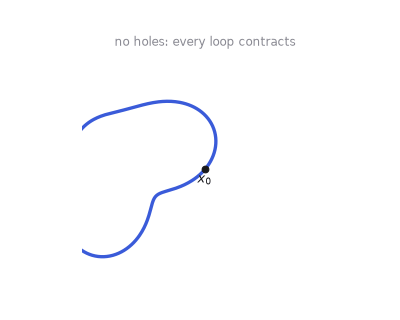

It's worth keeping the three notions straight, since they form a strict hierarchy of coarseness:

| Relation | What it preserves | Example distinction |
| --- | --- | --- |
| homeomorphic | everything topological | annulus $\ne$ cylinder |
| homotopy equivalent | hole structure | annulus $\simeq$ cylinder $\simeq S^1$ |
| contractible | "no holes" (equivalence to a point) | disk yes, circle no |

Homeomorphic implies homotopy equivalent, never the reverse ($\mathbb{R}^n$ and a point are homotopy equivalent — collapse via straight lines — but a bijection between them is impossible for $n \geq 1$). And two spaces can be homotopy equivalent with neither being contractible: the annulus and the circle both have a hole; they're equivalent to each other, not to a point.

## Fundamental groups, and $\pi_n$

So far "hole" has been informal. The fundamental group makes it algebra. Fix a basepoint $x_0 \in X$. A loop is a continuous $\gamma : [0,1] \to X$ with $\gamma(0) = \gamma(1) = x_0$, and we consider loops up to homotopy that keep the endpoints pinned. Observe that concatenation of loops makes the set of homotopy classes a group:

$$
\pi_1(X, x_0) = \{\text{loops at } x_0\}/\simeq.
$$

The identity is the constant loop, and the group inverse of a loop is the same loop run backwards in "time". In a contractible space every loop contracts, so $\pi_1 = 0$. In the punctured plane, a loop around the puncture is stuck:

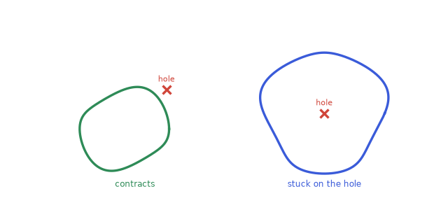

Since the punctured plane is homotopy equivalent to $S^1$, its fundamental group is that of the circle, and the circle's is the first real computation of the subject: a loop in $S^1$ is classified by its *winding number* — the net number of signed trips around — giving $\pi_1(S^1) \cong \mathbb{Z}$. (The proof lifts loops along $\mathbb{R} \to S^1$, $t \mapsto e^{2\pi i t}$; see Hatcher §1.1)

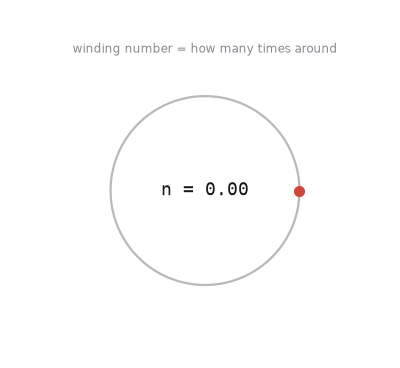

What about the basepoint? First define a path as a continous function from $[0,1]$ to a topological space $X$ (a loop without the ends having to meet). Now here's a basic theorem: if $x_0$ and $x_1$ in $X$ are connected by a path $h: [0,1] \mapsto X$, then

$$
\pi_1(X, x_1) \xrightarrow{\ \cong\ } \pi_1(X, x_0), \qquad [\gamma] \mapsto [\,h \cdot \gamma \cdot \bar{h}\,],
$$

where $h \cdot \gamma \cdot \bar{h}$ means "walk along $h$, do the loop, walk back." So in a path-connected space the fundamental group is one group up to isomorphism, and we drop the basepoint from the notation. (The isomorphism itself can depend on the choice of path — two paths that differ by a loop conjugate the answer — but the group is the same.)

Replacing the loop $[0,1] \to X$ with a map from the $n$-sphere gives the higher homotopy groups $\pi_n(X)$: $\pi_2$ probes with balloons instead of loops, and so on. The torus and the sphere make a clean contrast. On the torus, loops detect two independent holes:

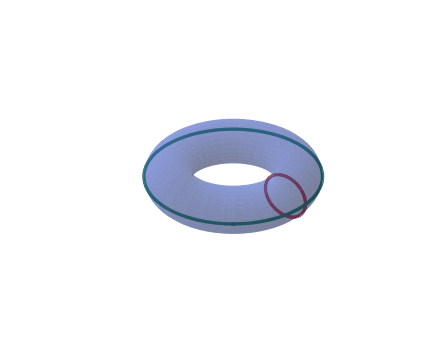

On the sphere every loop contracts, so $\pi_1(S^2) = 0$:

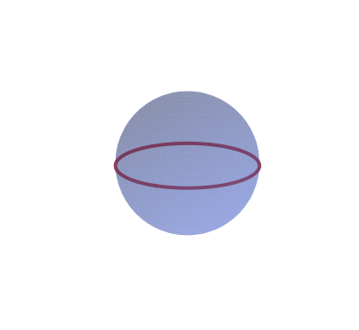

But the sphere encloses a cavity, and a sphere-shaped probe sees it — visualized most easily in $\mathbb{R}^3 \setminus \{0\}$, which is homotopy equivalent to $S^2$ by the same radial retraction as before:

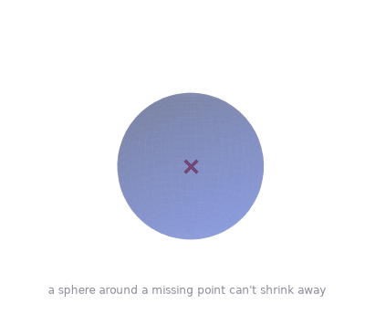

Homotopy equivalent spaces have isomorphic $\pi_n$ for every $n$ — the homotopy groups are invariants, which is what makes them powerful. The converse is more delicate, and this is worth knowing: having all homotopy groups abstractly isomorphic does *not* imply two spaces are homotopy equivalent. For readers with a bit of background in algebraic topology, the standard example is $\mathbb{RP}^2 \times S^3$ versus $S^2 \times \mathbb{RP}^3$: both have fundamental group $\mathbb{Z}/2$ and the same universal cover $S^2 \times S^3$, hence isomorphic $\pi_n$ for all $n$, yet their homology differs, so they are not homotopy equivalent. What is true is Whitehead's theorem: if a single map $f : X \to Y$ between CW complexes (defined below) induces isomorphisms on all homotopy groups, then $f$ is a homotopy equivalence. The map is the crucial extra element.

## Homology

Fundamental groups are expressive but hard to compute — they can be any group at all by attaching CW-complexes, but deciding whether a finitely presented group is trivial is undecidable (no generic algorithm for reducing group relations) in general. Homology is the tradeoff in the other direction: it linearizes the hole-counting problem. It sees a simplified version of the same holes ($H_1$ is exactly the abelianization of $\pi_1$ for path-connected spaces where abelianization means the group elements of $H_{1}$ satisfy $ab=ba$), and computing it is linear algebra.

Homology is easiest to define on a *simplicial complex* — a space assembled from vertices, edges, triangles, tetrahedra, and their higher dimensional analogues (simplexes), glued along faces (the formal treatment is in the simplexes section below; for now, imagine a "triangulated / tessellated space"). Work is done over the field $\mathbb{Z}/2$ (yes, not a group w.r.t. the coefficients used to produce homology group elements), which is what most applied topology uses.

A *$k$-chain* is a formal sum of $k$-simplexes — equivalently, just a subset of them, since coefficients are $0$ or $1$. Chains form a vector space $C_k$ with the $k$-simplexes as basis. The *boundary operator* $\partial_k : C_k \to C_{k-1}$ sends each simplex to the sum of its $(k-1)$-dimensional faces:

$$
\partial_1(ab) = a + b, \qquad \partial_2(abc) = ab + bc + ca,
$$

extended linearly. The fundamental identity for simplexes is

$$
\partial_{k} \circ \partial_{k+1} = 0
$$

— the boundary of a boundary is empty (each $(k-1)$-face of a $(k+1)$-simplex appears in exactly two of its $k$-faces, and $1 + 1 = 0$ over $\mathbb{Z}/2$). A chain complex is based on this identity and is formed by vector spaces connected by the boundary maps that compose to zero (notice the arrows point towards the trivial group in the limit).

$$
\cdots \xrightarrow{\ \partial_3\ } C_2 \xrightarrow{\ \partial_2\ } C_1 \xrightarrow{\ \partial_1\ } C_0 \xrightarrow{\ \partial_0\ } 0
$$

Define *cycles* $Z_k = \ker \partial_k$ (chains with no boundary — closed loops, closed surfaces) and *boundaries* $B_k = \mathrm{im}\, \partial_{k+1}$ (chains that bound something one dimension up). The identity $\partial^2 = 0$ says $B_k \subseteq Z_k$, so we can form the quotient

$$
H_k = Z_k / B_k,
$$

the *$k$-th homology*. A hole is a cycle that is not a boundary: it closes up, but nothing fills it. $H_0$ counts connected components, $H_1$ counts independent loop-type holes, $H_2$ counts cavities.

Now for a worked example that is small enough to do by hand. Triangulate the circle as a hollow triangle: vertices $a, b, c$, edges $ab, bc, ca$, no 2-simplex. Then $\partial_1$ as a matrix (rows $a,b,c$; columns $ab, bc, ca$):

$$
\partial_1 = \begin{pmatrix} 1 & 0 & 1 \\ 1 & 1 & 0 \\ 0 & 1 & 1 \end{pmatrix}
$$

Its rank is $2$, so $\ker \partial_1$ has dimension $3 - 2 = 1$: the single cycle $ab + bc + ca$, the loop around the triangle. There are no 2-simplexes, so $B_1 = 0$ and

$$
H_1 = \mathbb{Z}/2, \qquad H_0 = C_0 / \mathrm{im}\,\partial_1 \cong \mathbb{Z}/2 \ \ (\text{one component}).
$$

Now *fill* the triangle by adding the 2-simplex $abc$: its boundary $\partial_2(abc) = ab + bc + ca$ is exactly our cycle, so the cycle becomes a boundary and $H_1$ is therefore trivial (kernel is the previous boundary operator's image). A filled triangle is contractible and therfore has no holes. That's the whole mechanism of homology in one example — cycles are candidate holes, and higher-dimensional simplexes get rid of the fake ones (they're boundary is the image of that boundary operator that is in the bottom of the quotient).

Over the integers instead of $\mathbb{Z}/2$, the boundary matrices have entries $\pm 1$ (simplexes get orientations), and homology is computed by putting them in *Smith normal form* — the integer analogue of Gaussian elimination, diagonalizing by row and column operations. The diagonal reveals both the ranks (Betti numbers $\beta_k = \dim H_k$) and any torsion. Either way, the computation is matrix reduction with cost polynomial in the number of simplexes. Compare that with the intractable computation problem for $\pi_1$ and the tradeoff is clear: homology forgets some structure (it can't tell the order loops are composed in) but in exchange becomes something you can compute more easily.

## Convexity

A set $C \subseteq \mathbb{R}^n$ is *convex* if it contains the straight segment between any two of its points: $x, y \in C \Rightarrow (1-t)x + ty \in C$ for all $t \in [0,1]$.

The property we need: every convex set is contractible. Pick any $c \in C$ and slide along straight lines, $H(x, t) = (1-t)x + tc$. Convexity is exactly the guarantee that the homotopy stays inside $C$. Balls are convex, and — the fact that powers everything below — an intersection of convex sets is convex: if two points lie in every set of a family, so does the segment between them.

## A good cover

A *cover* of $X$ is a family of open sets $\mathcal{U} = \{U_i\}$ whose union is $X$. A *good cover* is one where every finite intersection $U_{i_0} \cap \cdots \cap U_{i_k}$ is either empty or contractible. The sets have no interesting topology of their own, and neither do their overlaps — all the topology of $X$ lives in *which* sets intersect, not in *how*.

Open balls in $\mathbb{R}^n$ give good covers for free: each ball is convex, an intersection of balls is an intersection of convex sets, hence convex, hence empty or contractible. So any union of open balls — for instance, a union of balls around sample points, which is where we're headed — comes equipped with a good cover: the balls themselves.

## The nerve of a cover

The *nerve* $N(\mathcal{U})$ of a cover records precisely that intersection pattern, as a combinatorial object:

- one vertex per set $U_i$,
- an edge $\{i, j\}$ whenever $U_i \cap U_j \neq \emptyset$,
- a triangle $\{i, j, k\}$ whenever $U_i \cap U_j \cap U_k \neq \emptyset$,
- and in general a $k$-simplex for every $(k+1)$-fold nonempty intersection.

Note the downward closure is automatic: if a triple intersection is nonempty, so are the three pairwise ones, so every face of a simplex in the nerve is in the nerve. The nerve is an abstract simplicial complex, built purely from finite data.

## The Čech complex

Apply this to the cover we get for free. Given a point cloud $P \subset \mathbb{R}^n$ — say, states an agent has visited — and a radius $r$, the *Čech complex* is the nerve of the cover by balls:

$$
\check{C}_r(P) = N\big(\{B(p, r) : p \in P\}\big).
$$

A $k$-simplex enters $\check{C}_r$ exactly when $k+1$ of the balls share a common point. As $r$ grows, simplexes only get added, never removed — which forms a *filtration*. Watch what happens over a point cloud sampled from a loop (a filtration):

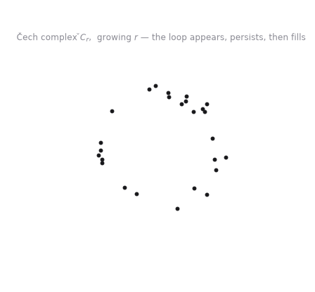

This is the object that will let us say "the data has a hole" in a way a computer can verify (although less computationally tractable than we'd like). But first we owe ourselves the theorem that says the nerve is true to measuring the holes of the original space.

## The nerve lemma

*Nerve lemma.* If $\mathcal{U}$ is a good open cover of a paracompact space $X$ (any closed subspace of $\mathbb{R}^n$), then the nerve is homotopy equivalent to the space:

$$
N(\mathcal{U}) \simeq X.
$$

For a union of balls around sample points, this says the Čech complex — a finite combinatorial object — has in principle the same holes as the the union of balls, in every dimension.

The proof is fairly complex despite the obvious inclination towards a partition of unity with the paracompactness constraint – see Hatcher §4.G for the full argument.

The picture to keep: three balls arranged in a triangle with all pairwise overlaps but no triple overlap have nerve = hollow triangle $\simeq$ circle, and indeed their union has a hole in the middle. Add a triple overlap and the nerve gains the 2-simplex, the union loses its hole, and both sides agree again — the tetrahedron, triangle, and edge cases from the simplex animation below are exactly the nerves of four, three, and two mutually overlapping balls.

## Simplexes, CW complexes, and the symmetric group

We've been leaning on simplexes informally; here's the actual object. The *standard $n$-simplex* is

$$
\Delta^n = \Big\{ (x_0, \dots, x_n) \in \mathbb{R}^{n+1} \;\Big|\; x_i \geq 0,\ \textstyle\sum_i x_i = 1 \Big\},
$$

the convex hull of the $n+1$ standard basis vectors — the coordinates $(x_0, \dots, x_n)$ are the *barycentric coordinates* the nerve-lemma map $f$ was producing. A simplicial complex glues these along faces:

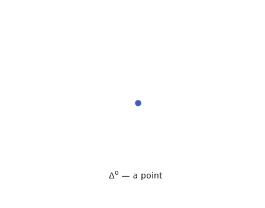

The Čech complex is one of these. More general still are *CW complexes*, which build spaces by attaching $n$-dimensional disks ("cells") along arbitrary continuous maps on their boundaries, not just face-to-face gluings. The degree to which this construction generalizes to the topological objects we study is large: a sphere $S^2$ is one 0-cell plus one 2-cell (crush the disk's entire boundary to the point); a torus is one 0-cell, two 1-cells, and one 2-cell (the classic square-with-identified-edges picture) — versus 14 triangles for its smallest triangulation. Simplicial complexes are CW complexes of the most rigid kind; the rigidity is what makes them computable, the generality is what makes CW complexes the right construction for theorems like Whitehead's (makes homotopy group equivalence the same as homotopy equivalence in the CW-complex category).

One more structural remark, and it's the reason "symmetric" is somewhat a part of the post's focus. An abstract simplex in a nerve is a *set* of cover elements — it has no preferred vertex ordering. The relabelings of $n+1$ vertices form the symmetric group $S_{n+1}$, which acts on $\Delta^n$ by permuting barycentric coordinates, each permutation acting as a linear homeomorphism of the simplex onto itself:

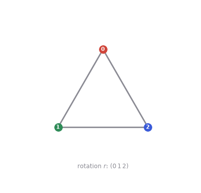

When you formalize "simplicial object with unordered vertices" you get *symmetric* simplicial sets (presheaves on finite nonempty sets) as opposed to the ordered kind (presheaves on finite ordered sets) that dominate homotopy theory. For everything computational in this post the distinction goes unnoticed — the algorithm just picks an ordering of the points and works with it — but the nerve is naturally a symmetric object, and the $S_{n+1}$ action on each simplex is the structure that says so.

## The trouble with the radius

The nerve lemma is a statement about the union of balls, not about the underlying space the points were sampled from — and the gap between those two is controlled by $r$.

- $r$ too small: the balls don't overlap, and $\check{C}_r$ is a cloud of isolated vertices. Pure $H_0$, no structure.
- $r$ too large: everything overlaps everything, the complex becomes one giant completely filled-in high-dimensional simplex w/ no holes / structure.
- $r$ in the right band: the union of balls thickens the sample into something with the same holes as the true space, and the Čech complex reports them faithfully.

The right band depends on the sampling density and on how "thick" the true space's features are, and no single $r$ is guaranteed to work everywhere at once. The practical answer — visible in the Čech animation above — is to not choose: sweep $r$ across the whole range and track each feature's birth and death. Features that live across a wide interval of $r$ are signal of real topological features; features that flicker in and out are sampling noise. This is the homological *persistence*.

The other problem with $\check{C}_r$ is computational. To decide whether a $k$-simplex belongs to it you must check whether $k+1$ balls share a common point — a smallest-enclosing-ball computation for every candidate subset. That's a lot of geometry to do, in every dimension, for every value of $r$ in a sweep.

## The Vietoris–Rips complex

The fix is to only ever check pairs. Fix the convention that matches the Čech radius: include a simplex when the balls of radius $r$ intersect *pairwise*,

$$
\mathrm{VR}_r(P) = \big\{ \sigma \subseteq P \ \text{finite} : B(p, r) \cap B(q, r) \neq \emptyset \ \text{for all } p, q \in \sigma \big\},
$$

equivalently, when all pairwise distances satisfy $d(p,q) \leq 2r$. The Vietoris–Rips complex is completely determined by the distance matrix of the point cloud — no smallest-enclosing-ball tests nor ambient interesections. That's why it's the default in machine learning algorithms.

The price is that VR guesses higher simplexes from pairwise data. Three balls can intersect pairwise while sharing no common point, which is easy to see if you look closely at the below animation:

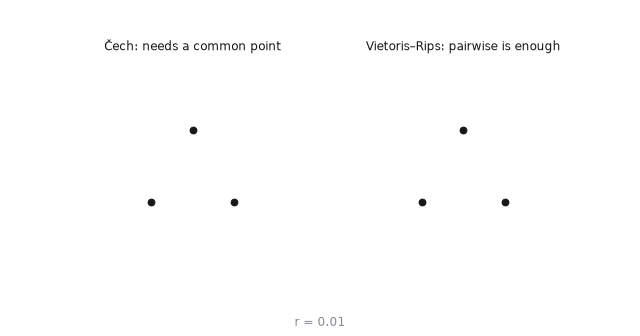

So $\mathrm{VR}_r$ has every simplex $\check{C}_r$ has, and then some. The remarkable thing is that the error is bounded (especially when we thing of error in terms of the persistence of such homological features), and the bound is the next theorem.

## The sandwich theorem

$$
\check{C}_r \ \subseteq\ \mathrm{VR}_r \ \subseteq\ \check{C}_{2r}.
$$

Both inclusions have two-line proofs.

*First inclusion.* If $k+1$ balls of radius $r$ share a common point, then in particular they intersect pairwise. Thus, every Čech simplex is a VR simplex at the same $r$ value. $\blacksquare$

*Second inclusion.* Let $\sigma$ be a VR simplex of radius $r$, so all pairwise distances in $\sigma$ are at most $2r$. Pick any vertex $p_0 \in \sigma$. Then every vertex $q \in \sigma$ has $d(p_0, q) \leq 2r$, i.e. $p_0 \in B(q, 2r)$ — so $p_0$ is a *common point* of all the balls of radius $2r$, and $\sigma \in \check{C}_{2r}$. $\blacksquare$

(Observe in Euclidean space the factor 2 improves: the circumradius of a set of diameter $2r$ in $\mathbb{R}^n$ is bounded by $r\sqrt{2n/(n+1)} < r\sqrt{2}$, giving $\mathrm{VR}_r \subseteq \check{C}_{r\sqrt{2}}$.)

Why this matters for persistence: the theorem says the VR filtration is *interleaved* with the Čech filtration — each is trapped between two snapshots of the other, one small radial factor apart. A hole in the data that persists in the Čech filtration from $r$ to $R$ with $R \geq 2r$ must be visible in the VR filtration somewhere in between, and vice versa: neither filtration can invent or destroy a *long-lived* feature that the other doesn't see. At a single radius they can disagree — the equilateral-triangle animation is exactly such a disagreement — so short-lived features are untrustworthy in both. For very small $r$ (relative to the feature sizes and sampling density) the two complexes coincide; the sandwich is what lets us trust VR at the medium scales where they diverge.

## Computing the homology of $\mathrm{VR}_r$

The pipeline, end to end:

1. From the distance matrix, list the simplexes of $\mathrm{VR}_r$ (in practice up to dimension 2 or 3), each tagged with its *birth scale* — the smallest $r$ at which it appears, which for VR is just half the longest pairwise distance in the simplex.
2. Order all simplexes by birth scale and assemble the boundary matrices $\partial_k$ over $\mathbb{Z}/2$, exactly as in the homology section.
3. Reduce the matrix — once.

Step 3 is the conceptual leap, so it deserves to be unpacked. Up through step 2 nothing new is happening: freeze the scale at any one $r$ and you have an ordinary chain complex

$$
C_2 \xrightarrow{\ \partial_2\ } C_1 \xrightarrow{\ \partial_1\ } C_0,
$$

and its homology is exactly the computation from the homology section — cycles $Z_k = \ker \partial_k$, boundaries $B_k = \mathrm{im}\,\partial_{k+1}$, $H_k = Z_k / B_k$. That tells you the holes at *one* value of $r$. But we want all values: as $r$ grows, edges appear, then triangles, then tetrahedra, and the homology keeps changing. Naively you would recompute from scratch at every scale. *Persistence* computes every scale in a single reduction — and, beyond that, identifies which simplex created each hole and which simplex later destroyed it.

*The key trick.* Instead of one boundary matrix per scale, build one boundary matrix for the whole filtration, with rows and columns ordered by birth. Take the hollow-triangle-then-filled story from the homology section and give it a schedule:

| simplex | $a$ | $b$ | $c$ | $ab$ | $bc$ | $ca$ | $abc$ |
| --- | --- | --- | --- | --- | --- | --- | --- |
| birth $r$ | $0$ | $0$ | $0$ | $1$ | $1$ | $2$ | $3$ |

The full boundary matrix in exactly that column order (dots are zeros):

$$
\partial \;=\; \begin{array}{c|ccccccc}
& a & b & c & ab & bc & ca & abc \\ \hline
a & \cdot & \cdot & \cdot & 1 & \cdot & 1 & \cdot \\
b & \cdot & \cdot & \cdot & 1 & 1 & \cdot & \cdot \\
c & \cdot & \cdot & \cdot & \cdot & 1 & 1 & \cdot \\
ab & \cdot & \cdot & \cdot & \cdot & \cdot & \cdot & 1 \\
bc & \cdot & \cdot & \cdot & \cdot & \cdot & \cdot & 1 \\
ca & \cdot & \cdot & \cdot & \cdot & \cdot & \cdot & 1 \\
abc & \cdot & \cdot & \cdot & \cdot & \cdot & \cdot & \cdot
\end{array}
$$

Notice that every simplex's boundary consists only of simplices born no later than it — faces always precede the things they bound. So the matrix is upper triangular with respect to filtration order, automatically.

*Now reduce it.* This is Gaussian elimination over $\mathbb{Z}/2$ with one restriction: the only allowed move is adding an *earlier* column into a *later* one. Columns never leave filtration order. Sweep left to right, and whenever two columns share the same *lowest* $1$, add the earlier into the later; repeat until every nonzero column has its lowest $1$ in a distinct row.

*Reading off births and deaths.* Here is the theorem that makes it all work. After reduction:

- a column that reduced to zero means its simplex *created* a class — a birth, at that simplex's birth scale;
- a nonzero column with lowest $1$ in row $\tau$ means its simplex *destroyed* the class that $\tau$ created — pairing $\tau$'s birth with this simplex's birth as the death.

Concretely: an edge column whose lowest $1$ lands on a vertex killed a connected component (the edge merged two components, and the younger one dies). A triangle column whose lowest $1$ lands on an edge killed a loop (the edge completed the loop; the triangle filled it in).

Run it on the example. Columns $a, b, c$ are already zero: three components born at $r = 0$. Column $ab$ has lowest $1$ on $b$: the merge pairs $b$'s component off as $(0, 1)$. Column $bc$ likewise: $(0, 1)$. Column $ca$ is the interesting one: its lowest $1$ collides with $bc$'s, so add $bc$ into it; the result collides with $ab$'s, so add $ab$ too — and the column vanishes. Zero column: $ca$ *created* something, namely the loop, born at $r = 2$. Finally, column $abc$ reduces with lowest $1$ on row $ca$: the triangle kills the loop, giving the pair

$$
(\,\mathrm{birth}(ca),\ \mathrm{birth}(abc)\,) = (2, 3).
$$

And $a$ is never anyone's lowest $1$ — the component that survives to $r = \infty$. Total output: $H_0$ pairs $(0,1)$, $(0,1)$, $(0,\infty)$ and one $H_1$ pair $(2,3)$.

*Why Betti numbers (counting loops, ccs, and voids) aren't enough.* Suppose you only computed $\beta_1 = 1$ at $r = 0.8$. That says a loop exists at that scale — not when it formed, how long it lasts, or which simplex kills it. A spike in noise at one scale and a structural loop spanning the whole filtration both read "$\beta_1 = 1$" if you sample a single $r$. The pairing is the information.

*The persistence diagram.* Plot every finite pair as a point (birth, death). Height above the diagonal is lifespan: points far above the diagonal are features that survived a wide range of scales — genuine structure — while points hugging the diagonal are born and die almost immediately — sampling noise that's omitted. Here is the whole pipeline running on the annulus cloud from the Čech section, the diagram assembling itself as $r$ sweeps (hollow markers are features still alive at the current scale; they stop where they "die"):

So step 3 is not a different kind of algebra from homology — it is the same boundary-matrix reduction (Smith normal form is the integer-coefficient analogue), performed once on the filtration-ordered matrix. The reduction computes the homology of every scale simultaneously, and the lowest-$1$ pairing hands you each feature's creator and destroyer, which is exactly the (birth, death) list the diagram plots.

And the chain of theorems that connects the output back to the ground truth:

$$
\text{true space} \ \xleftarrow[\text{(sampling)}]{\ \simeq\ }\ \bigcup_p B(p, r) \ \xleftarrow[\text{(nerve lemma)}]{\ \simeq\ }\ \check{C}_r \ \xleftarrow[\text{(sandwich)}]{\ \text{interleaved}\ }\ \mathrm{VR}_r
$$

## Cohomology in practice

Use any serious TDA library (Ripser for example) and you'll find it computes persistent *cohomology* — the dual theory, where cochains assign values to simplexes and the coboundary runs the arrow the other way, $\delta : C^k \to C^{k+1}$, still with $\delta^2 = 0$. For now we will avoid this optimization, but in a future blog post we will study it.

## Where the holes are: exploration

Back to the motivation from the top of the post. An agent exploring an environment is building a point cloud — states it has visited — and everything above assembles into a pipeline that runs on exactly that data: visited states $\to$ distance matrix $\to$ $\mathrm{VR}_r$ filtration $\to$ persistence diagram $\to$ a list of robust holes, each with a representative cycle locating it.

Concretely, in a MiniGrid-style gridworld: take the visited cells as points with the natural metric (grid or graph distance). $H_0$ of the visitation cloud counts disconnected explored regions — two clusters the agent hasn't linked up. $H_1$ flags loops of visited states around unvisited pockets. $H_2$ would flag enclosed voids in 3-D worlds; for flat gridworlds, $H_0$ and $H_1$ carry essentially all the signal, and they're the cheap ones to compute.

So suppose we have an environment with a chamber sealed behind a door that takes five key turns to open. Undirected exploration fills the reachable space and then goes flat — every cell equally boring:

The visitation cloud now has a single persistent $H_1$ class — one hole, wrapped around the chamber. A go-explore-style method treats all rarely-visited frontier cells alike; it will eventually stumble through the five key turns, but nothing in its objective distinguishes the door from any other wall cell it keeps bumping into. Now add one term to the exploration bonus, biasing the agent toward cells lying on the persistent $H_1$ representative cycle. The bias concentrates probability mass exactly on the ring of cells surrounding the unexplored pocket — which is where the door is (this can be biased further towards ones with relatively unexplored actions that could potentially go in the hole / void in higher dimensions). The hole is precisely the topological signature of "there is somewhere here you haven't been," and unlike a novelty count it doesn't wash out with visitation, doesn't depend on the reward signal, and doesn't care how the state representation obscurs distances with bounded noise. Perturb the environment, add noise to the features, or learn the metric badly and the long bars in the persistence diagram are the features that survive. 

---

*Further reading: Hatcher's* Algebraic Topology *(free online) for sections 1–9 done properly — §1.1 for fundamental groups, Chapter 2 for homology, §4.G for the nerve lemma. Edelsbrunner & Harer's* Computational Topology *for the Čech/VR/persistence pipeline. Oudot's* Persistence Theory *for interleaving made precise. De Silva–Morozov–Vejdemo-Johansson for persistent cohomology and circular coordinates.*
