Background assumed: this post is the computational companion to [the previous post on basic topology](/blog/basic_topology_and_symmetric_simplexes) and builds a solid foundation for the theory of topological RL exploration in grid spaces we will pursue next. Linear algebra (kernels, images, ranks, transposes) will be used throughout, but not to anything below the surface level–so no need for the spectral decomposition theorem or understand general jordan blocks & degenerate eigenvectors. Everything here is example-driven: the goal is that by the end you have computed, by hand, the homology and cohomology of (almost) every space I plan on using for my "topological RL exploration gym env benchmark suite", and that you can understand what exactly the underlying TDA library we use (GUDHI) does under the hood.

The previous post showed that homology is the computable analogue of hole-counting: chains are vectors, the boundary operator is a matrix, and homology is a quotient of a kernel by an image. What it did with one worked example (the hollow triangle), this post does systematically. We run the same fixed template on a sequence of spaces, starting from a single point and ending at $\mathbb{CP}^2$, and the template never changes. We / I (aliens) believe that homology and its variants involve a lot of machinery, and even if one can give a superficial explanation of what that machinery is after first seeing it, to actually gain an intuition and working memory for it requires repeated examples worked out in full. 

Here is the template we will follow throughout for each space $X$:

1. Define the complex: the set $K_n$ of $n$-simplexes (or cells) for each $n$, and how they're glued.
2. Write down the chain groups $C_n$.
3. Write down each boundary map $\partial_n : C_n \to C_{n-1}$ — first by what it does to each generator, then as a matrix.
4. Do the same for the coboundary maps $\delta^n : C^n \to C^{n+1}$ on cochains.
5. Compute homology $H_n = \ker \partial_n / \mathrm{im}\, \partial_{n+1}$.
6. Compute cohomology $H^n = \ker \delta^n / \mathrm{im}\, \delta^{n-1}$.

For the first several examples we then add a seventh step: put the space's vertices in a point cloud, grow a filtration over a sequence of scales $\varepsilon$, watch the chain groups change, and read off the persistence diagram.

## Conventions, and cochains defined properly

Chains first, as a reminder. Fix a simplicial complex $K$ with $K_n$ its set of $n$-simplexes. Over the field $\mathbb{Z}/2$ (our default until the Klein bottle forces a change), the chain group $C_n$ is the vector space of formal sums of $n$-simplexes with coefficients in $\{0, 1\}$ — equivalently, subsets of $K_n$ — with the simplexes of $K_n$ as basis. The boundary map sends a simplex to the sum of its codimension-one faces:

$$
\partial_n [v_0 v_1 \cdots v_n] = \sum_{i=0}^{n} [v_0 \cdots \widehat{v_i} \cdots v_n],
$$

where the hat means "delete this vertex." Over $\mathbb{Z}/2$ there are no signs to track, which is why applied topology defaults to these coefficients when it can.

Cochains are the new object in this post, so let's define them carefully. The cochain group $C^n$ is the dual space

$$
C^n = \mathrm{Hom}(C_n, \mathbb{Z}/2),
$$

the space of linear functionals on $n$-chains: a cochain $\varphi \in C^n$ assigns a scalar to every $n$-simplex, and extends linearly to assign a scalar to every $n$-chain. Think of a cochain as a measurement you can run on chains. $C^n$ has a natural basis dual to the simplexes: for each $\sigma \in K_n$, the functional $\sigma^*$ defined by

$$
\sigma^*(\tau) = \begin{cases} 1 & \tau = \sigma \\ 0 & \tau \in K_n,\ \tau \neq \sigma. \end{cases}
$$

So $\dim C^n = \dim C_n$, and writing a cochain in the dual basis lists its value on each simplex.

The coboundary map is precomposition with the boundary:

$$
\delta^n : C^n \to C^{n+1}, \qquad (\delta^n \varphi)(\tau) = \varphi(\partial_{n+1} \tau).
$$

In words: to evaluate $\delta \varphi$ on an $(n+1)$-simplex, evaluate $\varphi$ on its boundary. From $\partial \circ \partial = 0$ we get $\delta \circ \delta = 0$ for free, since $(\delta\delta\varphi)(\tau) = \varphi(\partial\partial\tau) = 0$. And in the dual bases, the matrix of $\delta^n$ is exactly the transpose of the matrix of $\partial_{n+1}$. That single fact is worth internalizing: cohomology costs nothing extra computationally — same matrices, transposed, arrows reversed:

$$
0 \to C^0 \xrightarrow{\ \delta^0 = \partial_1^{\!\top}\ } C^1 \xrightarrow{\ \delta^1 = \partial_2^{\!\top}\ } C^2 \xrightarrow{\ \delta^2\ } \cdots
$$

Cohomology is then the same quotient construction run on this complex: cocycles $Z^n = \ker \delta^n$, coboundaries $B^n = \mathrm{im}\, \delta^{n-1}$, and

$$
H^n = Z^n / B^n.
$$

Over a field, $\dim H^n = \dim H_n$ always (rank-nullity applied to transposes), so for most of Part 1 cohomology will look like a shadow of homology. The examples were chosen so that you first get fluent in the mechanics while the answers are predictable — and then, from the Klein bottle onward, we switch to $\mathbb{Z}$ coefficients and watch homology and cohomology genuinely diverge.

One more convention: we write vertices as letters $a, b, c, \dots$, an edge with vertex set $\{a,b\}$ as $ab$, a triangle as $abc$, and so on. $H_n \cong (\mathbb{Z}/2)^k$ is abbreviated by its dimension ("$\dim H_1 = 2$") when the meaning is clear.

# Part 1: the machinery on the simplest shapes

## Example 1: a point

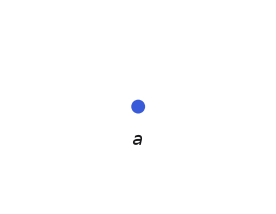

**The complex.** One 0-simplex: $K_0 = \{a\}$. Nothing in any higher dimension.

**Chain groups.** $C_0 = \mathbb{Z}/2\{a\} \cong \mathbb{Z}/2$, spanned by the single chain $a$. Every other $C_n = 0$. The whole chain complex, on one line:

$$
0 \to \underbrace{\mathbb{Z}/2}_{C_0} \xrightarrow{\ \partial_0\ } 0.
$$

Since this is the first example, it's worth pinning down what kind of algebraic object $C_0$ is. The coefficients $\mathbb{Z}/2 = \{0, 1\}$ form a field: you can add, multiply, and divide by anything nonzero (there is only one nonzero element, and it is its own inverse). Over a field, "formal sums of simplexes" means $C_0$ is a vector space — specifically the vector space with basis $K_0$, also called the free $\mathbb{Z}/2$-module on $K_0$, where free means the basis elements satisfy no relations except the ones the axioms force. The traditional name "chain group" is also correct — every vector space is an abelian group under its addition — it just forgets the scalar multiplication; the name is inherited from the integer-coefficient theory, where a group is all you get. Here $K_0$ has one element, so $C_0$ is a 1-dimensional vector space, which as a set has exactly two elements: $0$ and $a$.

**Boundary maps.** There is only $\partial_0 : C_0 \to 0$. Computed on every element it can be applied to — $C_0$ has exactly two, the zero chain and the chain $a$:

$$
\partial_0(0) = 0, \qquad \partial_0(a) = 0,
$$

both landing on the only element of the trivial group. What is its matrix? A matrix has one row per basis element of the target and one column per basis element of the source — and the target here is the trivial vector space $C_{-1} = 0$, which has no basis elements. So the matrix is the $0 \times 1$ empty matrix: one column for $a$, no rows. (It is tempting to write a $1 \times 1$ zero matrix instead, since $\partial_0$ "sends $a$ to $0$" — but that $0$ is the zero vector of a zero-dimensional space, and a $1 \times 1$ matrix would claim the target is one-dimensional. The convention where $\partial_0$ genuinely gets a nonzero $1 \times 1$ matrix is reduced homology, which augments the complex with a $C_{-1} \cong \mathbb{Z}/2$ generated by the empty simplex; we won't need it.) Either way, every $0$-chain is in the kernel: $\ker \partial_0 = C_0$.

**Coboundary maps.** $C^0 = \mathrm{Hom}(C_0, \mathbb{Z}/2) \cong \mathbb{Z}/2$ also has exactly two elements: the zero functional and the dual functional $a^*$. As a measurement, $a^*$ reads off the coefficient of $a$ — computed on each element of $C_0$:

$$
a^*(0) = 0, \qquad a^*(a) = 1.
$$

Now the coboundary of each cochain, straight from the definition $(\delta^0 \varphi)(\tau) = \varphi(\partial_1 \tau)$. A degree-1 coboundary must eat 1-chains, and $C_1 = 0$ has only $\tau = 0$, so there is exactly one value to compute:

$$
(\delta^0 a^*)(0) = a^*(\partial_1 0) = a^*(0) = 0,
$$

hence $\delta^0 a^* = 0$ (the zero functional on the zero space), and $\delta^0 0 = 0$ likewise: $\delta^0$ is the zero map. The cochain complex:

$$
0 \to \underbrace{\mathbb{Z}/2}_{C^0} \xrightarrow{\ \delta^0\ } 0.
$$

**Homology.** $Z_0 = \ker \partial_0 = C_0$ (everything is a cycle in degree 0), and $B_0 = \mathrm{im}\, \partial_1 = 0$ since there are no edges. So

$$
H_0 = C_0 / 0 \cong \mathbb{Z}/2, \qquad H_n = 0 \ (n \geq 1).
$$

In the same diagram style as the chain complex — homology degree by degree, top degree on the left, degree 0 on the right (a convention we'll keep). The arrows are the maps that $\partial$ induces on homology, $[z] \mapsto [\partial_n z]$, and every one of them is the zero map: a homology class is represented by a cycle, and $\partial_n z = 0$ for a cycle by definition. So the homology of a chain complex is itself a chain complex — one whose boundary maps are all zero, which is why nothing further can be computed from it:

$$
0 \to \underbrace{\mathbb{Z}/2}_{H_0} \to 0.
$$

One connected component, no holes of any dimension. This is the homology of any contractible space, and it's the baseline every other example gets compared against.

**Cohomology.** $Z^0 = \ker \delta^0 = C^0$, $B^0 = 0$, so $H^0 \cong \mathbb{Z}/2$ and $H^n = 0$ for $n \geq 1$. Note what a degree-0 cocycle is, because the interpretation recurs: a functional on vertices with $\delta \varphi = 0$, i.e. a labeling of vertices that is constant along every edge (vacuous here, but not for long). Cocycles in degree 0 are locally constant functions, and $\dim H^0$ counts connected components just like $\dim H_0$ does. The cohomology diagram (degree 0 on the left, matching the cochain complex's direction; the induced coboundary maps are zero for the same reason the induced boundary maps were):

$$
0 \to \underbrace{\mathbb{Z}/2}_{H^0} \to 0.
$$

## Example 2: a line segment

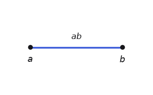

**The complex.** $K_0 = \{a, b\}$, $K_1 = \{ab\}$.

**Chain groups.** $C_0 \cong (\mathbb{Z}/2)^2$ with basis $\{a, b\}$; $C_1 \cong \mathbb{Z}/2$ with basis $\{ab\}$. The chain complex:

$$
0 \to \underbrace{\mathbb{Z}/2}_{C_1} \xrightarrow{\ \partial_1\ } \underbrace{(\mathbb{Z}/2)^2}_{C_0} \xrightarrow{\ \partial_0\ } 0.
$$

Continuing the structural note from example 1: $C_0$ is a 2-dimensional vector space over the 2-element field, so as a set it has $2^2 = 4$ elements — $0$, $a$, $b$, and $a + b$ — and you could in principle check every claim below by exhausting them. Contrast with what the same construction gives over other coefficients: with $\mathbb{Z}$ in place of $\mathbb{Z}/2$, formal sums with integer coefficients form the free abelian group $\mathbb{Z}a \oplus \mathbb{Z}b \cong \mathbb{Z}^2$ — the analogous object, but now a module over the ring $\mathbb{Z}$ rather than a vector space, because $\mathbb{Z}$ is not a field ($2$ has no integer inverse). The distinction pays off at the quotient step of homology: a quotient of a vector space is again a vector space, completely described by one number (its dimension — this is why homology over $\mathbb{Z}/2$ reduces to Betti numbers), while a quotient of a free abelian group need not be free — $\mathbb{Z}/2\mathbb{Z}$ itself is the standard example — and that failure of freeness is precisely the torsion phenomenon we'll meet at the Klein bottle.

**Boundary maps.** On the generator: $\partial_1(ab) = a + b$. As a matrix (rows $a, b$; the single column $ab$):

$$
\partial_1 = \begin{pmatrix} 1 \\ 1 \end{pmatrix}
$$

**Coboundary maps.** $C^0$ has dual basis $\{a^*, b^*\}$, defined by what each measures on the basis of $C_0$:

$$
a^*(a) = 1, \quad a^*(b) = 0, \qquad b^*(a) = 0, \quad b^*(b) = 1,
$$

so a general 0-cochain $\alpha\, a^* + \beta\, b^*$ sends the chain $x\, a + y\, b$ to $\alpha x + \beta y$. Likewise $C^1$ has dual basis $\{(ab)^*\}$, defined by $(ab)^*(ab) = 1$. On generators: $(\delta^0 a^*)(ab) = a^*(\partial_1\, ab) = a^*(a + b) = 1$, and likewise for $b^*$, so

$$
\delta^0 a^* = (ab)^*, \qquad \delta^0 b^* = (ab)^*, \qquad
\delta^0 = \partial_1^{\!\top} = \begin{pmatrix} 1 & 1 \end{pmatrix}.
$$

The other coboundary map is $\delta^1 : C^1 \to C^2 = 0$. There are no 2-simplexes, so $\delta^1 (ab)^*$ is a functional with nothing to evaluate on — $\delta^1$ is the zero map, with the $0 \times 1$ empty matrix one dimension up from example 1's. The cochain complex — same groups, arrows reversed:

$$
0 \to \underbrace{(\mathbb{Z}/2)^2}_{C^0} \xrightarrow{\ \delta^0\ } \underbrace{\mathbb{Z}/2}_{C^1} \xrightarrow{\ \delta^1\ } 0.
$$

**Homology.** $\partial_1$ has rank 1, so $\mathrm{im}\, \partial_1$ is the line spanned by $a + b$ and $\ker \partial_1 = 0$. Then

$$
H_0 = C_0 / \langle a + b \rangle \cong \mathbb{Z}/2, \qquad H_1 = \ker \partial_1 = 0.
$$

The homology diagram:

$$
0 \to \underbrace{0}_{H_1} \xrightarrow{\ 0\ } \underbrace{\mathbb{Z}/2}_{H_0} \to 0.
$$

Read the $H_0$ computation as gluing: the relation $a + b = 0$, i.e. $a = b$, says the edge merged the two vertices into one component. The segment has the homology of a point — it is contractible, and homology can't tell contractible spaces apart.

**Cohomology.** $Z^0 = \ker \delta^0 = \{0, a^* + b^*\}$: the locally constant functionals, assigning the same value to $a$ and $b$ — one component again, $H^0 \cong \mathbb{Z}/2$. In degree 1, $Z^1 = C^1$ (top degree, $\delta^1 = 0$) and $B^1 = \mathrm{im}\, \delta^0 = \langle (ab)^* \rangle = C^1$, so $H^1 = 0$. The cohomology diagram:

$$
0 \to \underbrace{\mathbb{Z}/2}_{H^0} \xrightarrow{\ 0\ } \underbrace{0}_{H^1} \to 0.
$$

## Example 3: the hollow triangle

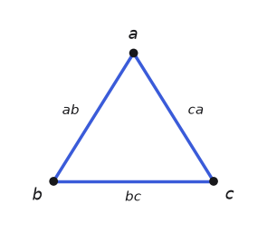

This is the smallest simplicial model of the circle, and the first space with a hole.

**The complex.** $K_0 = \{a, b, c\}$, $K_1 = \{ab, bc, ca\}$, $K_2 = \emptyset$.

**Chain groups.** $C_0 \cong (\mathbb{Z}/2)^3$, $C_1 \cong (\mathbb{Z}/2)^3$. The chain complex:

$$
0 \to \underbrace{(\mathbb{Z}/2)^3}_{C_1} \xrightarrow{\ \partial_1\ } \underbrace{(\mathbb{Z}/2)^3}_{C_0} \xrightarrow{\ \partial_0\ } 0.
$$

**Boundary maps.** $\partial_1(ab) = a + b$, $\partial_1(bc) = b + c$, $\partial_1(ca) = c + a$. As a matrix (rows $a, b, c$; columns $ab, bc, ca$):

$$
\partial_1 = \begin{pmatrix} 1 & 0 & 1 \\ 1 & 1 & 0 \\ 0 & 1 & 1 \end{pmatrix}
$$

**Coboundary maps.** $\delta^0 = \partial_1^{\!\top}$. Compute $\delta^0 a^*$ from the definition by evaluating it on each edge:

$$
(\delta^0 a^*)(ab) = a^*(a + b) = 1, \qquad
(\delta^0 a^*)(bc) = a^*(b + c) = 0, \qquad
(\delta^0 a^*)(ca) = a^*(c + a) = 1,
$$

so $\delta^0 a^* = (ab)^* + (ca)^*$ — the measurement "coefficient of $a$" pulls back to "how many of the edges touching $a$ are present," which is the graph-theoretic coboundary of a vertex. The cochain complex:

$$
0 \to \underbrace{(\mathbb{Z}/2)^3}_{C^0} \xrightarrow{\ \delta^0\ } \underbrace{(\mathbb{Z}/2)^3}_{C^1} \xrightarrow{\ \delta^1\ } 0.
$$

**Homology.** $\partial_1$ has rank 2 (columns sum to zero, any two are independent). So $\ker \partial_1$ is 1-dimensional, spanned by

$$
z = ab + bc + ca,
$$

the loop around the triangle. No 2-simplexes means $B_1 = 0$, so

$$
H_1 = \langle z \rangle \cong \mathbb{Z}/2, \qquad H_0 = C_0 / \mathrm{im}\,\partial_1 \cong \mathbb{Z}/2,
$$

$$
0 \to \underbrace{\mathbb{Z}/2}_{H_1} \xrightarrow{\ 0\ } \underbrace{\mathbb{Z}/2}_{H_0} \to 0.
$$

One component, one loop. This matches $S^1$, as it must — homology is a homotopy invariant, and this complex is homeomorphic to the circle.

**Cohomology.** $Z^1 = C^1$ (top degree), and $B^1 = \mathrm{im}\, \delta^0$ has dimension 2, so $\dim H^1 = 3 - 2 = 1$. A representative cocycle: $(ab)^*$, the functional "how many times does a chain use the edge $ab$?" It is not a coboundary — no vertex labeling produces it — and up to coboundaries it is the same as $(bc)^*$ or $(ca)^*$. The interpretation is a counting meter on the loop: any cycle that goes around the triangle once gets measured $1$ by $(ab)^*$. Where the homology class is the loop itself, the cohomology class is a detector of loops. That duality — hole versus hole-detector — is the core idea of cohomology, and it's why cohomology classes are often easier to use in applications: you can evaluate them on data. The cohomology diagram:

$$
0 \to \underbrace{\mathbb{Z}/2}_{H^0} \xrightarrow{\ 0\ } \underbrace{\mathbb{Z}/2}_{H^1} \to 0.
$$

## Example 4: the filled triangle

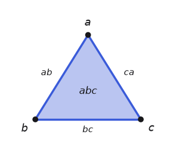

**The complex.** $K_0 = \{a, b, c\}$, $K_1 = \{ab, bc, ca\}$, $K_2 = \{abc\}$.

**Chain groups.** $C_0 \cong (\mathbb{Z}/2)^3$, $C_1 \cong (\mathbb{Z}/2)^3$, $C_2 \cong \mathbb{Z}/2$. The chain complex:

$$
0 \to \underbrace{\mathbb{Z}/2}_{C_2} \xrightarrow{\ \partial_2\ } \underbrace{(\mathbb{Z}/2)^3}_{C_1} \xrightarrow{\ \partial_1\ } \underbrace{(\mathbb{Z}/2)^3}_{C_0} \xrightarrow{\ \partial_0\ } 0.
$$

**Boundary maps.** $\partial_1$ is the same matrix as before. The new map is $\partial_2(abc) = ab + bc + ca$, with matrix (rows $ab, bc, ca$):

$$
\partial_2 = \begin{pmatrix} 1 \\ 1 \\ 1 \end{pmatrix}
$$

Check the fundamental identity: $\partial_1 \partial_2 (abc) = \partial_1(ab + bc + ca) = (a+b) + (b+c) + (c+a) = 0$ over $\mathbb{Z}/2$. Each vertex appears exactly twice.

**Coboundary maps.** A new dimension means a new dual basis: $C^2$ is spanned by $(abc)^*$, the functional defined by $(abc)^*(abc) = 1$ — it reads off the coefficient of the triangle in a 2-chain, just as $a^*$ read off the coefficient of a vertex. Then $\delta^1 = \partial_2^{\!\top} = \begin{pmatrix} 1 & 1 & 1 \end{pmatrix}$: computing on the generator $(ab)^*$ via the definition, $(\delta^1 (ab)^*)(abc) = (ab)^*(\partial_2 abc) = (ab)^*(ab + bc + ca) = 1$, so $\delta^1 (ab)^* = (abc)^*$, and the same for the other two edges — every edge is a face of the one triangle. The cochain complex:

$$
0 \to \underbrace{(\mathbb{Z}/2)^3}_{C^0} \xrightarrow{\ \delta^0\ } \underbrace{(\mathbb{Z}/2)^3}_{C^1} \xrightarrow{\ \delta^1\ } \underbrace{\mathbb{Z}/2}_{C^2} \xrightarrow{\ \delta^2\ } 0.
$$

**Homology.** $\ker \partial_1 = \langle ab + bc + ca \rangle$ as before, but now $\mathrm{im}\, \partial_2 = \langle ab + bc + ca \rangle$ too. The cycle is a boundary:

$$
H_1 = \langle z \rangle / \langle z \rangle = 0, \qquad H_2 = \ker \partial_2 = 0, \qquad H_0 \cong \mathbb{Z}/2,
$$

$$
0 \to \underbrace{0}_{H_2} \xrightarrow{\ 0\ } \underbrace{0}_{H_1} \xrightarrow{\ 0\ } \underbrace{\mathbb{Z}/2}_{H_0} \to 0.
$$

Filling the triangle killed the loop. This pairing — example 3 versus example 4 — is the mechanism of all homology: cycles are candidate holes, and simplexes one dimension up cancel the fake ones.

**Cohomology.** The detector dies too, but by the dual mechanism. $(ab)^*$ is still a functional, but it is no longer a cocycle: $\delta^1 (ab)^* = (abc)^* \neq 0$. For a functional on edges to be a cocycle it must vanish on $\partial_2(abc) = ab + bc + ca$, i.e. use an even number of the triangle's edges. So $Z^1 = \{0,\ (ab)^* + (bc)^*,\ (bc)^* + (ca)^*,\ (ab)^* + (ca)^*\}$, which is exactly $\mathrm{im}\, \delta^0 = B^1$. Hence $H^1 = 0$, and in degree 2: $Z^2 = C^2$, $B^2 = \mathrm{im}\, \delta^1 = C^2$, so $H^2 = 0$. Homology kills the hole by making the cycle a boundary; cohomology kills the detector by disqualifying it as a cocycle. Same matrices, transposed. The cohomology diagram:

$$
0 \to \underbrace{\mathbb{Z}/2}_{H^0} \xrightarrow{\ 0\ } \underbrace{0}_{H^1} \xrightarrow{\ 0\ } \underbrace{0}_{H^2} \to 0.
$$

## Example 5: the hollow tetrahedron

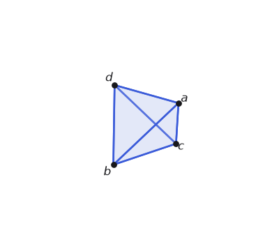

This is $\partial \Delta^3$, the smallest triangulation of the 2-sphere, and the first space with a cavity.

**The complex.**

$$
\begin{aligned}
K_0 &= \{a, b, c, d\} \\
K_1 &= \{ab, ac, ad, bc, bd, cd\} \\
K_2 &= \{abc, abd, acd, bcd\}
\end{aligned}
$$

All four triangles, but not the solid 3-simplex $abcd$.

**Chain groups.** $C_0 \cong (\mathbb{Z}/2)^4$, $C_1 \cong (\mathbb{Z}/2)^6$, $C_2 \cong (\mathbb{Z}/2)^4$. The chain complex:

$$
0 \to \underbrace{(\mathbb{Z}/2)^4}_{C_2} \xrightarrow{\ \partial_2\ } \underbrace{(\mathbb{Z}/2)^6}_{C_1} \xrightarrow{\ \partial_1\ } \underbrace{(\mathbb{Z}/2)^4}_{C_0} \xrightarrow{\ \partial_0\ } 0.
$$

**Boundary maps.** $\partial_1$ (rows $a,b,c,d$; columns $ab, ac, ad, bc, bd, cd$):

$$
\partial_1 = \begin{pmatrix}
1 & 1 & 1 & 0 & 0 & 0 \\
1 & 0 & 0 & 1 & 1 & 0 \\
0 & 1 & 0 & 1 & 0 & 1 \\
0 & 0 & 1 & 0 & 1 & 1
\end{pmatrix}
$$

$\partial_2$ on generators: $\partial_2(abc) = ab + ac + bc$, and similarly for the rest. As a matrix (rows $ab, ac, ad, bc, bd, cd$; columns $abc, abd, acd, bcd$):

$$
\partial_2 = \begin{pmatrix}
1 & 1 & 0 & 0 \\
1 & 0 & 1 & 0 \\
0 & 1 & 1 & 0 \\
1 & 0 & 0 & 1 \\
0 & 1 & 0 & 1 \\
0 & 0 & 1 & 1
\end{pmatrix}
$$

**Coboundary maps.** $\delta^0 = \partial_1^{\!\top}$ ($6 \times 4$), $\delta^1 = \partial_2^{\!\top}$ ($4 \times 6$). On generators, $\delta^1 (ab)^* = (abc)^* + (abd)^*$: the edge $ab$ is a face of exactly the two triangles containing it. The cochain complex:

$$
0 \to \underbrace{(\mathbb{Z}/2)^4}_{C^0} \xrightarrow{\ \delta^0\ } \underbrace{(\mathbb{Z}/2)^6}_{C^1} \xrightarrow{\ \delta^1\ } \underbrace{(\mathbb{Z}/2)^4}_{C^2} \xrightarrow{\ \delta^2\ } 0.
$$

**Homology.** Ranks: $\mathrm{rank}\, \partial_1 = 3$ (the complex is connected: $4 - 3 = 1$ component), $\mathrm{rank}\, \partial_2 = 3$. Then:

- $H_0$: $\dim = 4 - 3 = 1$.
- $H_1$: $\ker \partial_1$ has dimension $6 - 3 = 3$, and $\mathrm{im}\, \partial_2$ has dimension 3. Are they equal? Yes — each triangle boundary is a cycle, and the three independent ones span. $\dim H_1 = 3 - 3 = 0$. Every loop on the sphere bounds.
- $H_2$: $\ker \partial_2$ has dimension $4 - 3 = 1$, spanned by

$$
z_2 = abc + abd + acd + bcd,
$$

the sum of all four faces — the closed shell. There are no 3-simplexes, so $B_2 = 0$ and $H_2 \cong \mathbb{Z}/2$.

$$
0 \to \underbrace{\mathbb{Z}/2}_{H_2} \xrightarrow{\ 0\ } \underbrace{0}_{H_1} \xrightarrow{\ 0\ } \underbrace{\mathbb{Z}/2}_{H_0} \to 0.
$$

One component, no loop-type holes, one enclosed cavity: the sphere. The cycle $z_2$ is the 2-dimensional analogue of the triangle's loop: its boundary is zero because every edge of the tetrahedron belongs to exactly two faces, so everything cancels in pairs.

**Cohomology.** Same dimensions ($1, 0, 1$), field coefficients. The generator of $H^2$ can be taken to be $(abc)^*$ — "how many times does a 2-chain use the face $abc$?" Any one face works, because any two faces differ by a coboundary. This functional measures how many times a closed surface chain wraps the cavity, the 2-dimensional version of the loop counter from example 3. The cohomology diagram:

$$
0 \to \underbrace{\mathbb{Z}/2}_{H^0} \xrightarrow{\ 0\ } \underbrace{0}_{H^1} \xrightarrow{\ 0\ } \underbrace{\mathbb{Z}/2}_{H^2} \to 0.
$$

## Example 6: the solid tetrahedron

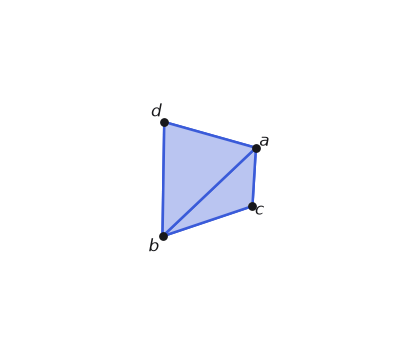

**The complex.** Everything from example 5 plus $K_3 = \{abcd\}$.

**Chain groups.** As before, plus $C_3 \cong \mathbb{Z}/2$. The chain complex:

$$
0 \to \underbrace{\mathbb{Z}/2}_{C_3} \xrightarrow{\ \partial_3\ } \underbrace{(\mathbb{Z}/2)^4}_{C_2} \xrightarrow{\ \partial_2\ } \underbrace{(\mathbb{Z}/2)^6}_{C_1} \xrightarrow{\ \partial_1\ } \underbrace{(\mathbb{Z}/2)^4}_{C_0} \xrightarrow{\ \partial_0\ } 0.
$$

**Boundary maps.** The new one: $\partial_3(abcd) = abc + abd + acd + bcd$, matrix

$$
\partial_3 = \begin{pmatrix} 1 \\ 1 \\ 1 \\ 1 \end{pmatrix}
$$

(rows $abc, abd, acd, bcd$). Its image is exactly the shell $z_2$.

**Coboundary maps.** $C^3$ is spanned by the new dual functional $(abcd)^*$, defined by $(abcd)^*(abcd) = 1$. Then $\delta^2 = \partial_3^{\!\top} = \begin{pmatrix} 1 & 1 & 1 & 1 \end{pmatrix}$: computed on a generator, $(\delta^2 (abc)^*)(abcd) = (abc)^*(\partial_3 abcd) = 1$, so $\delta^2 (abc)^* = (abcd)^*$ — and likewise for each face. The cochain complex:

$$
0 \to \underbrace{(\mathbb{Z}/2)^4}_{C^0} \xrightarrow{\ \delta^0\ } \underbrace{(\mathbb{Z}/2)^6}_{C^1} \xrightarrow{\ \delta^1\ } \underbrace{(\mathbb{Z}/2)^4}_{C^2} \xrightarrow{\ \delta^2\ } \underbrace{\mathbb{Z}/2}_{C^3} \xrightarrow{\ \delta^3\ } 0.
$$

**Homology.** Only degree 2 changes: $B_2 = \mathrm{im}\, \partial_3 = \langle z_2 \rangle$, which is all of $Z_2$, so $H_2 = 0$. And $\ker \partial_3 = 0$ gives $H_3 = 0$:

$$
0 \to \underbrace{0}_{H_3} \xrightarrow{\ 0\ } \underbrace{0}_{H_2} \xrightarrow{\ 0\ } \underbrace{0}_{H_1} \xrightarrow{\ 0\ } \underbrace{\mathbb{Z}/2}_{H_0} \to 0.
$$

The solid tetrahedron is contractible — homology of a point, again. Filling dimension $n$ kills $H_n$: the triangle filled its loop, the tetrahedron filled its cavity, and the pattern continues in every dimension.

**Cohomology.** Dually, $(abc)^*$ stops being a cocycle since $\delta^2 (abc)^* = (abcd)^* \neq 0$, and $H^2 = 0$. The cohomology diagram:

$$
0 \to \underbrace{\mathbb{Z}/2}_{H^0} \xrightarrow{\ 0\ } \underbrace{0}_{H^1} \xrightarrow{\ 0\ } \underbrace{0}_{H^2} \xrightarrow{\ 0\ } \underbrace{0}_{H^3} \to 0.
$$

By now the procedure should feel mechanical — that is the point. Six examples in, the steps are routine; what changes from here is only where the nonzero kernels and images land.

## Filtrations on the simple shapes

Now the seventh step. All six complexes above were static — someone handed us the simplexes. In applications nobody does: you get points, you pick a scale $\varepsilon$, and the complex grows as $\varepsilon$ does. A filtration is a nested family of complexes

$$
K_{\varepsilon_1} \subseteq K_{\varepsilon_2} \subseteq \cdots \subseteq K_{\varepsilon_m},
$$

one inclusion per scale, and each simplex gets a birth value: the smallest $\varepsilon$ at which it appears. The previous post built two filtrations from a point cloud $P$ — the Čech complex $\check{C}_\varepsilon(P)$ (a simplex per subset of balls with a common point) and the Vietoris–Rips complex $\mathrm{VR}_\varepsilon(P)$ (a simplex per subset with all pairwise distances $\leq 2\varepsilon$) — and proved they sandwich each other. Here we run them on the vertex sets of examples 1–6 and watch the chain groups, the homology, and the persistence diagrams come out.

The key structural fact: an inclusion $K_{\varepsilon} \subseteq K_{\varepsilon'}$ induces linear maps $C_n(K_\varepsilon) \to C_n(K_{\varepsilon'})$ (a chain is still a chain in the bigger complex) which commute with $\partial$, and therefore induce maps $H_n(K_\varepsilon) \to H_n(K_{\varepsilon'})$ on homology. A class is born at the first scale where it exists, and dies at the scale where its image under these maps becomes zero (merges into an older class or becomes a boundary). Persistence tracks each class across the whole sweep; the persistence diagram plots each class as the point (birth, death). For the mechanics of computing these pairings with a single matrix reduction, see the previous post — and the last section of this one, where we run the reduction explicitly.

### Two points

Take the segment's vertex set: two points at distance 1, and sweep $\varepsilon$ (for point sets this small, Čech and VR agree). Simplexes and births: $a, b$ at $\varepsilon = 0$; the edge $ab$ at $\varepsilon = 0.5$, when the two balls of radius $\varepsilon$ touch.

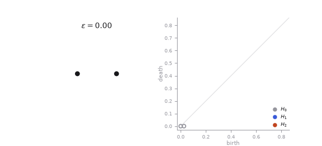

The chain-level story across the two stages:

| $\varepsilon$ | complex | $C_0$ | $C_1$ | $\dim H_0$ | $\dim H_1$ |
| --- | --- | --- | --- | --- | --- |
| $[0, 0.5)$ | $\{a, b\}$ | $(\mathbb{Z}/2)^2$ | $0$ | $2$ | $0$ |
| $[0.5, \infty)$ | example 2 | $(\mathbb{Z}/2)^2$ | $\mathbb{Z}/2$ | $1$ | $0$ |

The inclusion-induced map $H_0(K_0) \to H_0(K_{0.5})$ sends both generators $[a], [b]$ to the same class — the components merge. By the convention that the younger class dies (here they're the same age, so either), we record the pairs $(0, 0.5)$ and $(0, \infty)$. Nothing else ever happens: this filtration's diagram is two $H_0$ points and no higher-dimensional features, matching the segment's homology.

### Three points: where VR and Čech disagree

Take the triangle's vertices: an equilateral triangle with side 1. Now the two filtrations differ, and instructively.

- Vietoris–Rips: all three edges appear at $\varepsilon = 0.5$ — and so does the triangle $abc$, because VR adds a simplex as soon as all its pairwise distances are within bound. The loop is born and killed at the same instant. $H_1$ never exists.
- Čech: the three edges appear at $\varepsilon = 0.5$, but the triangle needs all three balls to share a common point, which happens at the circumradius $\varepsilon = 1/\sqrt{3} \approx 0.577$. The loop lives on the interval $[0.5, 0.577)$.


At the chain level, the Čech filtration passes through exactly examples 1, 3, and 4 of Part 1: isolated vertices, then the hollow triangle (with its $H_1 = \langle ab + bc + ca \rangle$), then the filled triangle (where $\mathrm{im}\,\partial_2$ absorbs the cycle). The persistence pairs: three $H_0$ births at 0, two dying at $0.5$, one essential; one $H_1$ pair $(0.5, 1/\sqrt{3})$. The interval is short — exactly what the sandwich theorem warns about. A feature that VR misses entirely and Čech barely sees is, at data scale, indistinguishable from noise; the loops worth trusting are the ones whose death is far from their birth in either filtration.

### Four points in a square

Four points at the corners of a unit square. Here VR and Čech happen to agree at every scale (the diagonal pairs and the triangles all arrive at $\varepsilon = \sqrt{2}/2$, since the circumradius of three corners of a unit square equals half the diagonal): edges at $0.5$, everything else at $\approx 0.707$.

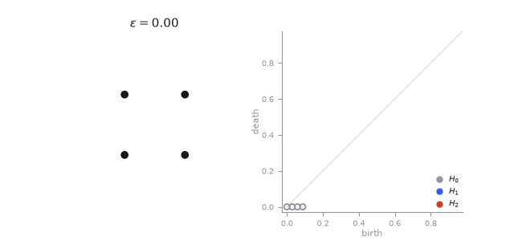

At $\varepsilon \in [0.5, 0.707)$ the complex is the 4-cycle: $C_0 \cong (\mathbb{Z}/2)^4$, $C_1 \cong (\mathbb{Z}/2)^4$, $\mathrm{rank}\, \partial_1 = 3$, so $\dim H_1 = 4 - 3 - 0 = 1$, generated by the perimeter $z = ab + bc + cd + da$. At $\varepsilon = \sqrt{2}/2$ the two diagonals, all four triangles, and the solid tetrahedron $abcd$ arrive together (VR adds every subset whose pairwise distances fit, all at once); $\mathrm{im}\, \partial_2$ now contains $z$ (sum the boundaries of two triangles sharing a diagonal) and $H_1$ dies. (The four triangles form a closed shell for an instant, but $abcd$ fills it at the same scale — a zero-lifetime $H_2$ class that never shows in the diagram.) Pairs: four $H_0$ births at 0 — three dying at $0.5$, one essential — and the $H_1$ pair $(0.5, \sqrt{2}/2)$. The square's loop lasts noticeably longer than the equilateral triangle's — roughly three times the interval — and stands clear of the diagonal.

### Four points, tetrahedron configuration

Finally the vertices of a regular tetrahedron with side 1 (a genuinely 3-dimensional point cloud), under the Čech filtration:

- $\varepsilon = 0.5$: all six edges — the complete graph $K_4$. $\dim H_1 = 6 - 3 = 3$: three independent loops.
- $\varepsilon = 1/\sqrt{3} \approx 0.577$: all four triangles — example 5, the hollow tetrahedron. The three loops die, and the shell class $z_2$ is born: $\dim H_2 = 1$.
- $\varepsilon = \sqrt{3/8} \approx 0.612$: the four balls share a common point (the centroid) and the solid $abcd$ arrives — example 6. The cavity dies.

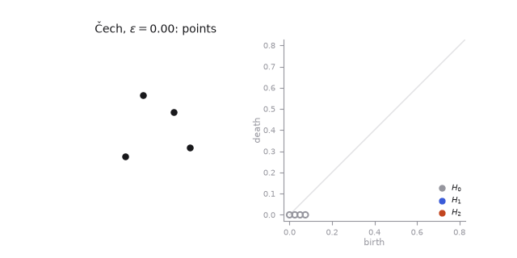

Pairs: four $H_0$ births (three die at $0.5$), three $H_1$ pairs $(0.5, 1/\sqrt{3})$, and one $H_2$ pair $(1/\sqrt{3}, \sqrt{3/8})$. Under VR instead, everything — edges, triangles, and the solid — arrives at once at $\varepsilon = 0.5$, and no $H_1$ or $H_2$ class is ever born; the same VR-blindness the equilateral triangle showed, one dimension up.

The pattern across all four filtrations: the persistence diagram summarizes the static computations from Part 1 across every scale at once, with the inclusion-induced maps connecting one scale to the next. Every complex we computed in Part 1 shows up at some value of $\varepsilon$ in one of these filtrations.

# Part 2: gluing constructions

The examples so far were convex-ish blobs and their boundaries. The interesting spaces of topology are built by identification: take a square, glue opposite edges, get a torus. Simplicial complexes handle these badly at first — a genuine simplicial triangulation of the torus needs at least 7 vertices and 14 triangles — so this part also upgrades our toolkit to $\Delta$-complexes, which permit gluings at a huge discount.

## Example 7: the torus

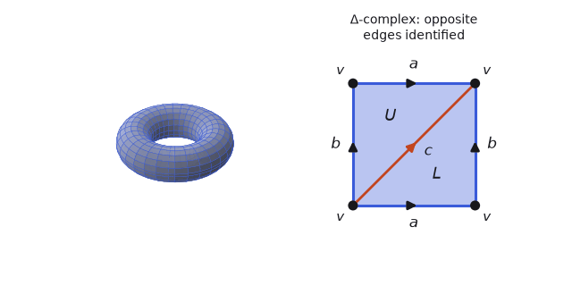

First, what goes wrong with plain simplicial complexes. In a simplicial complex a simplex is determined by its vertex set, and two simplexes may share at most one common face. Glue the square's edges and both triangles $U, L$ would have vertex set $\{v\}$ — illegal. The smallest legal triangulation of the torus is the 7-vertex, 21-edge, 14-triangle one (vertices $0..6$, triangles $\{i, i+1, i+3\}$ and $\{i+1, i+3, i+4\}$ mod 7). It works — the boundary matrices have ranks $\mathrm{rank}\, \partial_1 = 6$ and $\mathrm{rank}\, \partial_2 = 13$ over $\mathbb{Z}/2$, giving

$$
\dim H_0 = 7 - 6 = 1, \quad \dim H_1 = (21 - 6) - 13 = 2, \quad \dim H_2 = 14 - 13 = 1
$$

— but a $21 \times 14$ matrix is not something anyone wants to look at, let alone typeset.

A $\Delta$-complex keeps the simplex-with-ordered-faces structure but allows faces of the same simplex to be identified. (Formally: build the space from disjoint standard simplexes by gluing faces via the canonical linear maps; Hatcher §2.1. Every simplicial complex is a $\Delta$-complex; not conversely.) Homology is defined by the same chains-and-boundaries recipe, and a theorem guarantees it agrees with simplicial homology on any space that admits both structures. The torus as a $\Delta$-complex, from the figure:

**The complex.** $K_0 = \{v\}$, $K_1 = \{a, b, c\}$ (all three are loops at $v$ after gluing), $K_2 = \{U, L\}$.

**Chain groups.** $C_0 \cong \mathbb{Z}/2$, $C_1 \cong (\mathbb{Z}/2)^3$, $C_2 \cong (\mathbb{Z}/2)^2$. The chain complex:

$$
0 \to \underbrace{(\mathbb{Z}/2)^2}_{C_2} \xrightarrow{\ \partial_2\ } \underbrace{(\mathbb{Z}/2)^3}_{C_1} \xrightarrow{\ \partial_1 = 0\ } \underbrace{\mathbb{Z}/2}_{C_0} \xrightarrow{\ \partial_0\ } 0.
$$

**Boundary maps.** Every edge is a loop: $\partial_1 a = v + v = 0$, same for $b, c$, so $\partial_1 = 0$. For the triangles, read the figure: $L$ has edges $a, b, c$ and so does $U$:

$$
\partial_2 U = a + b + c, \qquad \partial_2 L = a + b + c, \qquad
\partial_2 = \begin{pmatrix} 1 & 1 \\ 1 & 1 \\ 1 & 1 \end{pmatrix}
$$

(rows $a, b, c$; columns $U, L$).

**Coboundary maps.** $\delta^0 = 0$; $\delta^1 = \partial_2^{\!\top}$. Computed on a generator: $(\delta^1 a^*)(U) = a^*(\partial_2 U) = a^*(a + b + c) = 1$ and likewise on $L$, so $\delta^1 a^* = U^* + L^*$, and the same for $b^*, c^*$. The cochain complex:

$$
0 \to \underbrace{\mathbb{Z}/2}_{C^0} \xrightarrow{\ \delta^0 = 0\ } \underbrace{(\mathbb{Z}/2)^3}_{C^1} \xrightarrow{\ \delta^1\ } \underbrace{(\mathbb{Z}/2)^2}_{C^2} \xrightarrow{\ \delta^2\ } 0.
$$

**Homology.** $\mathrm{rank}\, \partial_2 = 1$ (identical columns). So:

- $H_0 = C_0 = \mathbb{Z}/2$: one component.
- $H_1 = \ker \partial_1 / \mathrm{im}\, \partial_2 = C_1 / \langle a + b + c \rangle$, dimension $3 - 1 = 2$. Representatives: $a$ and $b$, the two core loops of the torus — around the tube and around the central hole. The relation $a + b + c = 0$ says the diagonal loop is homologous to the sum of the other two.
- $H_2 = \ker \partial_2 = \langle U + L \rangle \cong \mathbb{Z}/2$: the two triangles together form the closed surface, the torus's cavity class.

$$
0 \to \underbrace{\mathbb{Z}/2}_{H_2} \xrightarrow{\ 0\ } \underbrace{(\mathbb{Z}/2)^2}_{H_1} \xrightarrow{\ 0\ } \underbrace{\mathbb{Z}/2}_{H_0} \to 0,
$$

matching the 7-vertex computation exactly — 3 simplexes-worth of matrix instead of 35.

**Cohomology.** $Z^1 = \ker \delta^1 = \{\varphi : \varphi(a) + \varphi(b) + \varphi(c) = 0\}$, dimension 2; $B^1 = \mathrm{im}\, \delta^0 = 0$; so $\dim H^1 = 2$, with representative cocycles $a^* + c^*$ and $b^* + c^*$ (each vanishes on $a+b+c$). And $\dim H^2 = \dim C^2 - \mathrm{rank}\, \delta^1 = 2 - 1 = 1$. The $H^1$ generators are the two independent winding counters on the torus: one measures passage around the tube, the other around the hole. The cohomology diagram:

$$
0 \to \underbrace{\mathbb{Z}/2}_{H^0} \xrightarrow{\ 0\ } \underbrace{(\mathbb{Z}/2)^2}_{H^1} \xrightarrow{\ 0\ } \underbrace{\mathbb{Z}/2}_{H^2} \to 0.
$$

## Example 8: the wedge sum $S^1 \vee S^1$

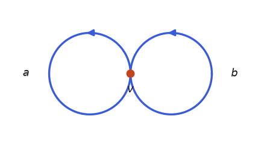

The wedge sum $X \vee Y$ glues one chosen point of $X$ to one chosen point of $Y$ and nothing else. (This is unrelated to the wedge product of differential forms; same word, different operation.) The figure eight is the classic example: two loops, one shared point — a space that is not a manifold at the wedge point, which does not affect the homology.

We could triangulate each circle as a hollow triangle (Example 3) and glue the two at a vertex, but the loop-at-a-vertex construction from the torus is far cheaper: a circle is one vertex with one loop-edge, so the figure eight is one vertex with two.

**The complex.** $K_0 = \{v\}$, $K_1 = \{a, b\}$ — two edges, each a loop at $v$.

**Chain groups.** $C_0 \cong \mathbb{Z}/2$, $C_1 \cong (\mathbb{Z}/2)^2$. The chain complex:

$$
0 \to \underbrace{(\mathbb{Z}/2)^2}_{C_1} \xrightarrow{\ \partial_1\ } \underbrace{\mathbb{Z}/2}_{C_0} \xrightarrow{\ \partial_0\ } 0.
$$

**Boundary map.** Every edge is a loop, so $\partial_1 a = v + v = 0$ and $\partial_1 b = v + v = 0$: the map is zero, with matrix $\begin{pmatrix} 0 & 0 \end{pmatrix}$ (rows $v$; columns $a, b$).

**Coboundary map.** $\delta^0 = \partial_1^{\!\top} = \begin{pmatrix} 0 \\ 0 \end{pmatrix}$, also zero. The cochain complex:

$$
0 \to \underbrace{\mathbb{Z}/2}_{C^0} \xrightarrow{\ \delta^0 = 0\ } \underbrace{(\mathbb{Z}/2)^2}_{C^1} \xrightarrow{\ \delta^1\ } 0.
$$

**Homology.** With $\partial_1 = 0$, every 1-chain is a cycle and none is a boundary ($B_1 = \mathrm{im}\, \partial_2 = 0$, no 2-cells), so $H_1 = C_1 \cong (\mathbb{Z}/2)^2$, generated by the two loops $a, b$. And $H_0 = C_0 / \mathrm{im}\, \partial_1 \cong \mathbb{Z}/2$:

$$
0 \to \underbrace{(\mathbb{Z}/2)^2}_{H_1} \xrightarrow{\ 0\ } \underbrace{\mathbb{Z}/2}_{H_0} \to 0.
$$

Two independent loops, independent because there is no relation to impose — the shared vertex contributes nothing to any boundary. Homology of a wedge is the direct sum of the parts' homologies in every positive degree (components merge in degree 0). That's the general rule: wedging stacks holes without interaction.

**Cohomology.** By the same zero maps,

$$
0 \to \underbrace{\mathbb{Z}/2}_{H^0} \xrightarrow{\ 0\ } \underbrace{(\mathbb{Z}/2)^2}_{H^1} \to 0,
$$

with $H^1$ generated by the loop detectors $a^*$ and $b^*$ — one counter per circle, each blind to the other circle's edge.

## Example 9: $\bigvee^n S^1$, a bouquet of $n$ circles

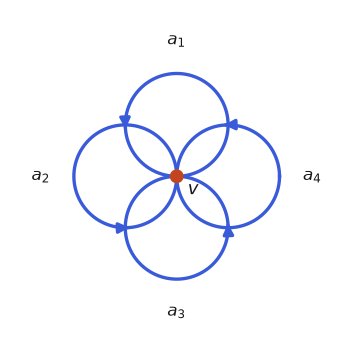

Same construction with $n$ petals: one vertex, $n$ loop-edges.

**The complex.** $K_0 = \{v\}$, $K_1 = \{a_1, \dots, a_n\}$, all loops at $v$. The chain complex:

$$
0 \to \underbrace{(\mathbb{Z}/2)^n}_{C_1} \xrightarrow{\ \partial_1 = 0\ } \underbrace{\mathbb{Z}/2}_{C_0} \to 0.
$$

**Boundary map.** Again every edge is a loop, so $\partial_1 = 0$ (the $1 \times n$ zero matrix).

**Homology.** $H_1 = \ker \partial_1 / \mathrm{im}\, \partial_2 = C_1 / 0 \cong (\mathbb{Z}/2)^n$, one generator per loop; $H_0 \cong \mathbb{Z}/2$:

$$
0 \to \underbrace{(\mathbb{Z}/2)^n}_{H_1} \xrightarrow{\ 0\ } \underbrace{\mathbb{Z}/2}_{H_0} \to 0.
$$

One loop per petal, no relations. Cohomology: $n$ independent petal counters,

$$
0 \to \underbrace{\mathbb{Z}/2}_{H^0} \xrightarrow{\ 0\ } \underbrace{(\mathbb{Z}/2)^n}_{H^1} \to 0.
$$

This example is the reason "rank of $H_1$" is a useful complexity measure for graphs and networks: any connected graph is homotopy equivalent to a bouquet of $E - V + 1$ circles, and its first homology counts independent cycles.

## Example 10: the Klein bottle, and the move to $\mathbb{Z}$

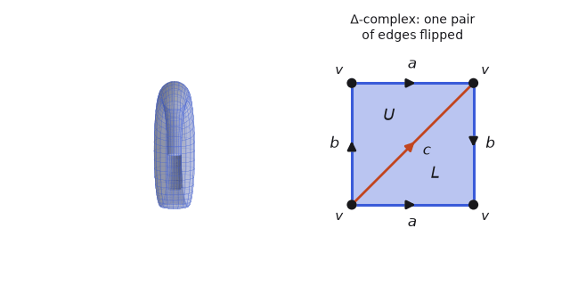

The Klein bottle's $\Delta$-complex is the torus's with one twist — literally. Identify the square's horizontal edges as before ($a$ with $a$), but the vertical edges with a reversal ($b$ with $b$, arrows opposing). Again one vertex, edges $a, b, c$, triangles $U, L$.

First, run the $\mathbb{Z}/2$ template: the boundary of each triangle picks up each of $a$, $b$, $c$ once regardless of direction, so $\partial_2 U = \partial_2 L = a + b + c$ — the same matrix as the torus. Same matrices, same answer:

$$
\dim H_0, \dim H_1, \dim H_2 = 1, 2, 1 \qquad (\text{over } \mathbb{Z}/2).
$$

But the Klein bottle and the torus are not homeomorphic, and not even homotopy equivalent — one is orientable, the other isn't. Over $\mathbb{Z}/2$, homology cannot see the difference. The fix is to use coefficients that can see direction: $\mathbb{Z}$.

Over $\mathbb{Z}$, chains have integer coefficients and simplexes have orientations (an ordering of vertices up to even permutation; reversing orientation negates the generator). The chain groups are now free abelian groups $\mathbb{Z}^{|K_n|}$ rather than vector spaces — the structural note from example 2 becomes load-bearing here, since quotients of free abelian groups are exactly where torsion can appear. The boundary map gains signs:

$$
\partial_n [v_0 \cdots v_n] = \sum_{i=0}^{n} (-1)^i [v_0 \cdots \widehat{v_i} \cdots v_n],
$$

and the identity $\partial \partial = 0$ now holds because each codimension-2 face appears twice with opposite signs. Rerun example 4 for calibration: with the triangle oriented $[a, b, c]$,

$$
\partial_2[a,b,c] = [b,c] - [a,c] + [a,b], \qquad
\partial_1 \partial_2 = (c - b) - (c - a) + (b - a) = 0.
$$

Now the Klein bottle. Orient the edges as in the figure ($a$: bottom left-to-right and top left-to-right; $b$: left edge upward and right edge downward — that's the flip; $c$: the diagonal). Reading off the two triangles:

$$
\partial_2 L = a - b - c, \qquad \partial_2 U = a + b - c, \qquad
\partial_2 = \begin{pmatrix} 1 & 1 \\ -1 & 1 \\ -1 & -1 \end{pmatrix}
$$

(rows $a, b, c$; columns $L, U$), and $\partial_1 = 0$ still (every edge is a loop at $v$). The integer chain complex:

$$
0 \to \underbrace{\mathbb{Z}^2}_{C_2} \xrightarrow{\ \partial_2\ } \underbrace{\mathbb{Z}^3}_{C_1} \xrightarrow{\ \partial_1 = 0\ } \underbrace{\mathbb{Z}}_{C_0} \xrightarrow{\ \partial_0\ } 0.
$$

Homology over $\mathbb{Z}$ is computed by Smith normal form — the integer analogue of row reduction, where the only moves are integer row/column operations (swap, negate, add an integer multiple). Reducing:

$$
\begin{pmatrix} 1 & 1 \\ -1 & 1 \\ -1 & -1 \end{pmatrix}
\rightsquigarrow
\begin{pmatrix} 1 & 0 \\ -1 & 2 \\ -1 & 0 \end{pmatrix}
\rightsquigarrow
\begin{pmatrix} 1 & 0 \\ 0 & 2 \\ 0 & 0 \end{pmatrix}
$$

(subtract column 1 from column 2; then clear the first column with row operations). The Smith form $\mathrm{diag}(1, 2)$ says: as a subgroup of $C_1 \cong \mathbb{Z}^3$, the image of $\partial_2$ is spanned by one basis vector and twice another. Therefore

$$
H_1 = \mathbb{Z}^3 / \mathrm{im}\, \partial_2 \cong \mathbb{Z} \oplus \mathbb{Z}/2.
$$

And $\ker \partial_2 = 0$ (the reduced matrix has independent columns), so

$$
H_2 = 0, \qquad H_0 \cong \mathbb{Z}.
$$

The homology diagram over $\mathbb{Z}$:

$$
0 \to \underbrace{0}_{H_2} \xrightarrow{\ 0\ } \underbrace{\mathbb{Z} \oplus \mathbb{Z}/2}_{H_1} \xrightarrow{\ 0\ } \underbrace{\mathbb{Z}}_{H_0} \to 0.
$$

Two phenomena the torus doesn't have, both from that diagonal 2:

- Torsion. The $\mathbb{Z}/2$ summand in $H_1$ is a loop $z$ (concretely $z = b$) which is not a boundary, but $2z$ is: travel the $b$ loop twice and the flip lets the doubled loop bound. Torsion is invisible over field coefficients and is precisely the algebraic signature of the twist.
- No fundamental class. $H_2 = 0$ says no integer combination of $U, L$ is a cycle: $\partial_2(xL + yU) = 0$ forces $x = y = 0$ (look at the $a$ and $b$ rows). You cannot orient the triangles consistently — the Klein bottle is non-orientable, and $H_2$ over $\mathbb{Z}$ detects orientability of a closed surface.

For contrast, the torus over $\mathbb{Z}$: $\partial_2 L = \partial_2 U = a + b - c$, Smith form $\mathrm{diag}(1, 0)$, giving $H_1 \cong \mathbb{Z}^2$ (no torsion) and $H_2 = \langle U - L \rangle \cong \mathbb{Z}$ (a fundamental class: opposite orientations glue into a global one).

**Cohomology over $\mathbb{Z}$.** Transpose and rerun on the cochain complex

$$
0 \to \underbrace{\mathbb{Z}}_{C^0} \xrightarrow{\ \delta^0 = 0\ } \underbrace{\mathbb{Z}^3}_{C^1} \xrightarrow{\ \delta^1 = \partial_2^{\!\top}\ } \underbrace{\mathbb{Z}^2}_{C^2} \xrightarrow{\ \delta^2\ } 0,
$$

and the computation (same Smith form, quotient on the other side) gives

$$
0 \to \underbrace{\mathbb{Z}}_{H^0} \xrightarrow{\ 0\ } \underbrace{\mathbb{Z}}_{H^1} \xrightarrow{\ 0\ } \underbrace{\mathbb{Z}/2}_{H^2} \to 0.
$$

Compare: $H_1 = \mathbb{Z} \oplus \mathbb{Z}/2$ but $H^1 = \mathbb{Z}$; $H_2 = 0$ but $H^2 = \mathbb{Z}/2$. Over $\mathbb{Z}$, cohomology is not a shadow of homology: the torsion migrated up one degree. This is the universal coefficient theorem in action — $H^n \cong \mathrm{Hom}(H_n, \mathbb{Z}) \oplus \mathrm{Ext}(H_{n-1}, \mathbb{Z})$, where the $\mathrm{Hom}$ part kills torsion in degree $n$ and the $\mathrm{Ext}$ part resurrects the torsion of degree $n - 1$. You'll see the same shift in every projective space below.

# Part 3: projective spaces

Real projective $n$-space $\mathbb{RP}^n$ is the space of lines through the origin in $\mathbb{R}^{n+1}$ — equivalently the $n$-sphere with antipodal points identified, since a line hits the sphere in two opposite points. These are the standard torsion factory of topology, and they make ideal test cases for the $\mathbb{Z}$-coefficient template.

## Example 11: $\mathbb{RP}^1$

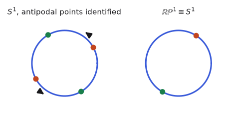

$\mathbb{RP}^1$ is a warm-up: the circle with antipodal points identified — and that quotient is again a circle (the top semicircle already contains one point from each antipodal pair, with its two endpoints identified; an arc with endpoints glued is $S^1$; the quotient map is the "angle doubling" map $z \mapsto z^2$). So the computation is example 3's:

$$
0 \to \underbrace{\mathbb{Z}}_{H_1} \xrightarrow{\ 0\ } \underbrace{\mathbb{Z}}_{H_0} \to 0, \qquad\text{and dually}\qquad 0 \to \underbrace{\mathbb{Z}}_{H^0} \xrightarrow{\ 0\ } \underbrace{\mathbb{Z}}_{H^1} \to 0,
$$

no torsion. As a cellular chain complex (one 0-cell, one 1-cell whose attaching map is degree $1 + (-1)^1 = 0$ — the pattern that generalizes below):

$$
0 \to \underbrace{\mathbb{Z}}_{C_1} \xrightarrow{\ \partial_1 = 0\ } \underbrace{\mathbb{Z}}_{C_0} \to 0.
$$

It's worth building that one 0-cell / one 1-cell structure honestly from the antipodal picture, because the same edge-collapse is what runs the RP² construction in the next example one dimension up. Start with the circle cut into two arcs by an antipodal pair of points $N$ and $S = -N$: two vertices, and two edges $a$ (the right arc, $S \to N$ through angle $0$) and $b$ (the left arc, $S \to N$ through angle $\pi$). Now impose the antipodal identification $x \sim -x$. It does two things:

- $N$ and $S$ are an antipodal pair, so they are glued into a single vertex $v$. The two vertices become one.
- The antipodal map carries the right arc onto the left arc, but with the direction reversed — it sends $a$'s start $S$ to $N$ and $a$'s end $N$ to $S$, tracing the left arc from $N$ to $S$. That is $b$ run backwards, so $b \sim a^{-1}$. The two edges become one.

So after identification $K_0 = \{v\}$ and $K_1 = \{a\}$: the edge $b$ is not a new generator, it is $a$ traversed in reverse. The surviving edge $a$ runs $v \to v$ — a loop, since its two endpoints $N, S$ are now the same point. Its boundary is $\partial_1 a = v - v = 0$, giving exactly the one-vertex, one-loop chain complex above, and the same $H_0 \cong \mathbb{Z}$, $H_1 = \ker \partial_1 \cong \mathbb{Z}$.

This is the projective-space pattern in its simplest case. The antipodal quotient folds a sphere onto itself, and in the process a pair of cells collapses into one, with an orientation flip. Here at $n = 1$ the flip is harmless — with no 2-cell around, the surviving loop $a$ stays a free generator and $H_1 = \mathbb{Z}$. The interesting case is when a cell one dimension up has that folded loop as its boundary and wraps it *twice*: that is what happens for $\mathbb{RP}^2$, where the analogous collapse leaves a 2-cell with $\partial = 2a$ and turns the free $\mathbb{Z}$ into the torsion group $\mathbb{Z}/2$. Projective spaces only get interesting one dimension up.

## Example 12: $\mathbb{RP}^2$


$\mathbb{RP}^2$ is the sphere with antipodal identification, or equivalently (keep the closed upper hemisphere, which meets every antipodal pair) a disk whose boundary circle has antipodal points identified. It cannot be embedded in $\mathbb{R}^3$, so the disk-with-identifications picture is as good as it gets visually.

**The complex.** From the figure: the square with both edge pairs flipped. Corners identify in two classes now: $K_0 = \{v, w\}$; $K_1 = \{a, b, c\}$ with $a, b$ running from $v$ to $w$ and back ($a: v \to w$, $b: w \to v$) and $c$ a loop at $v$; $K_2 = \{U, L\}$.

**Chain groups (over $\mathbb{Z}$).** $C_0 \cong \mathbb{Z}^2$, $C_1 \cong \mathbb{Z}^3$, $C_2 \cong \mathbb{Z}^2$. The chain complex:

$$
0 \to \underbrace{\mathbb{Z}^2}_{C_2} \xrightarrow{\ \partial_2\ } \underbrace{\mathbb{Z}^3}_{C_1} \xrightarrow{\ \partial_1\ } \underbrace{\mathbb{Z}^2}_{C_0} \xrightarrow{\ \partial_0\ } 0.
$$

**Boundary maps.** From the orientations in the figure:

$$
\partial_1 a = w - v, \quad \partial_1 b = v - w, \quad \partial_1 c = 0, \qquad
\partial_1 = \begin{pmatrix} -1 & 1 & 0 \\ 1 & -1 & 0 \end{pmatrix}
$$

(rows $v, w$), and

$$
\partial_2 L = a + b - c, \quad \partial_2 U = -a - b - c, \qquad
\partial_2 = \begin{pmatrix} 1 & -1 \\ 1 & -1 \\ -1 & -1 \end{pmatrix}.
$$

**Homology.** $\ker \partial_1$ is spanned by $a + b$ (the loop $v \to w \to v$ along the identified rim — this is the projective line inside $\mathbb{RP}^2$) and $c$; so $Z_1 \cong \mathbb{Z}^2$ with basis $\{a + b,\ c\}$. In that basis, $\partial_2 L = (a+b) - c$ and $\partial_2 U = -(a+b) - c$; the quotient is by the subgroup spanned by $(1, -1)$ and $(-1, -1)$, whose Smith form is $\mathrm{diag}(1, 2)$:

$$
H_1 \cong \mathbb{Z}^2 / \langle (1,-1), (-1,-1) \rangle \cong \mathbb{Z}/2.
$$

$\ker \partial_2 = 0$ (the two columns are independent), so $H_2 = 0$, and connectivity gives $H_0 \cong \mathbb{Z}$:

$$
0 \to \underbrace{0}_{H_2} \xrightarrow{\ 0\ } \underbrace{\mathbb{Z}/2}_{H_1} \xrightarrow{\ 0\ } \underbrace{\mathbb{Z}}_{H_0} \to 0.
$$

The generator of $H_1$ is the projective line $[a + b]$ — a loop that does not bound while its double does: $2(a + b) = \partial_2(L - U)$, which you can check directly from the columns above. Traverse the rim loop twice and it becomes the full boundary circle of the disk, which bounds. Also $H_2 = 0$: non-orientable, like the Klein bottle. And over $\mathbb{Z}/2$ the picture is $\dim H_0, H_1, H_2 = 1, 1, 1$ — over $\mathbb{Z}/2$ the surface can't tell its one-sidedness and even gets a fundamental class.

**Cohomology over $\mathbb{Z}$.** Transposing everything gives the cochain complex

$$
0 \to \underbrace{\mathbb{Z}^2}_{C^0} \xrightarrow{\ \delta^0 = \partial_1^{\!\top}\ } \underbrace{\mathbb{Z}^3}_{C^1} \xrightarrow{\ \delta^1 = \partial_2^{\!\top}\ } \underbrace{\mathbb{Z}^2}_{C^2} \xrightarrow{\ \delta^2\ } 0,
$$

and reducing:

$$
0 \to \underbrace{\mathbb{Z}}_{H^0} \xrightarrow{\ 0\ } \underbrace{0}_{H^1} \xrightarrow{\ 0\ } \underbrace{\mathbb{Z}/2}_{H^2} \to 0.
$$

The universal-coefficient shift again: $H_1$'s torsion vanishes from $H^1$ and reappears in $H^2$. This example is the cleanest place to see that homology and cohomology are genuinely different functors, not two notations for one thing.

For completeness: $\mathbb{RP}^2$ does have an honest simplicial triangulation — the smallest has 6 vertices, 15 edges, 10 triangles (quotient the icosahedron by the antipodal map; its faces are the 10 antipodal pairs of the icosahedron's 20). Running our machinery on it gives boundary ranks $\mathrm{rank}\,\partial_1 = 5$, $\mathrm{rank}\,\partial_2 = 9$ and Smith form of $\partial_2$ with nine 1's and one 2 — the same $H_* = \mathbb{Z}, \mathbb{Z}/2, 0$. Fifteen times the matrix entries for the same three groups — the $\Delta$-complex is plainly the better tool here.

## Example 13: $\mathbb{RP}^3$ and $\mathbb{RP}^4$, via cell complexes

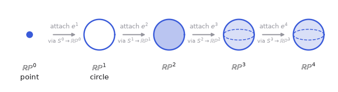

Full triangulations are now off the table — the smallest simplicial $\mathbb{RP}^3$ has 11 vertices and 40 tetrahedra (Walkup 1969, who proved 11 is minimal and classified all such triangulations), and the smallest known $\mathbb{RP}^4$ needs 16 vertices and several hundred simplexes. The right tool is the CW/cellular chain complex, the final generalization in this post. A CW complex attaches each $n$-cell to the lower skeleton by an arbitrary continuous map on its boundary sphere; the cellular chain group $C_n$ is free on the $n$-cells, and the boundary map's matrix entry between an $n$-cell and an $(n-1)$-cell is the degree of the induced map $S^{n-1} \to S^{n-1}$ (how many signed times the attaching map wraps that cell). Cellular homology agrees with simplicial homology whenever both are defined (Hatcher §2.2) — same $\ker/\mathrm{im}$ recipe, radically smaller matrices.

The cell structure: $\mathbb{RP}^n = e^0 \cup e^1 \cup \cdots \cup e^n$, one cell per dimension, where $e^k$ is attached via the quotient map $S^{k-1} \to \mathbb{RP}^{k-1}$ (the upper hemisphere of $S^k$ is a $k$-disk covering everything new; its boundary sphere maps by the antipodal identification). Every chain group is $\mathbb{Z}$, and the boundary maps alternate:

$$
\partial_k = \begin{cases} \times\, 2 & k \text{ even} \\ \times\, 0 & k \text{ odd}, \end{cases}
$$

and this is not a new rule to memorize — it is the same boundary computation from Examples 11 and 12, run one dimension at a time. The point is that $\partial(e^k)$ always contains the single cell $e^{k-1}$ *twice*. The attaching map wraps the boundary sphere $S^{k-1}$ of the $k$-cell as a double cover onto $\mathbb{RP}^{k-1}$, so its two hemispheres each sweep across the top cell $e^{k-1}$ once. The only question is the *relative* sign of the two sweeps. The first copy's sign is a free orientation choice — orient the cell either way — so call it $\sigma = \pm 1$; the second is then forced, and equals $\sigma$ times the degree of the antipodal map $A : S^{k-1} \to S^{k-1}$, the deck transformation that carries one hemisphere onto the other. That degree is $(-1)^k$ for a reason you can check by hand: on $S^{k-1} \subset \mathbb{R}^k$, the antipodal map $A(x) = -x$ negates all $k$ coordinates, so it is a composite of $k$ reflections, each orientation-reversing — degree $(-1)^k$. This is not a separate mechanism from the simplex boundary formula $\partial[x_0 \cdots x_k] = \sum_i (-1)^i [x_0 \cdots \widehat{x_i} \cdots x_k]$; the $(-1)^i$ there is a *permutation sign* (the parity of moving the deleted vertex past $i$ others), and if you triangulated $\mathbb{RP}^k$ and summed faces you would recover the same relative sign, because a reflection's degree and a permutation's sign are two names for the parity of the same orientation reversal. So the two copies come with signs $\sigma$ and $(-1)^k \sigma$, and

$$
\partial_k = \sigma\,\bigl(1 + (-1)^k\bigr) = \begin{cases} \pm 2 & k \text{ even} \\ 0 & k \text{ odd.} \end{cases}
$$

The overall $\sigma$ is immaterial for homology — multiplication by $+2$ and by $-2$ have the same kernel and image — so nothing is lost by taking $\sigma = +1$, which is the convention in the figure and table below (and the standard $\partial_k = 1 + (-1)^k$).

We have already seen both cases by hand:


At $\mathbb{RP}^1$ ($k=1$, odd) the two copies of the 0-cell are the head and tail of the loop, $+v$ and $-v$, and they cancel — the $\partial_1 = 0$ we computed there. At $\mathbb{RP}^2$ ($k=2$, even) the two copies of the 1-cell are swept the same way and reinforce — the doubling behind the $\mathrm{diag}(1,2)$ Smith form of Example 12. Every higher $\mathbb{RP}^n$ just continues to alternate:

| $k$ | copies of $e^{k-1}$ carry signs | $\partial_k = 1 + (-1)^k$ |
| --- | --- | --- |
| $1$ | $+1,\ -1$ | $0$ |
| $2$ | $+1,\ +1$ | $2$ |
| $3$ | $+1,\ -1$ | $0$ |
| $4$ | $+1,\ +1$ | $2$ |

For $\mathbb{RP}^3$ the cellular chain complex and homology:

$$
0 \to \mathbb{Z} \xrightarrow{\ 0\ } \mathbb{Z} \xrightarrow{\ 2\ } \mathbb{Z} \xrightarrow{\ 0\ } \mathbb{Z} \to 0
\qquad\Longrightarrow\qquad
0 \to \underbrace{\mathbb{Z}}_{H_3} \xrightarrow{\ 0\ } \underbrace{0}_{H_2} \xrightarrow{\ 0\ } \underbrace{\mathbb{Z}/2}_{H_1} \xrightarrow{\ 0\ } \underbrace{\mathbb{Z}}_{H_0} \to 0.
$$

Working right to left: $H_0 = \mathbb{Z}/\mathrm{im}(\times 0) = \mathbb{Z}$; $H_1 = \ker(\times 0)/\mathrm{im}(\times 2) = \mathbb{Z}/2\mathbb{Z}$; $H_2 = \ker(\times 2)/\mathrm{im}(\times 0) = 0$; $H_3 = \ker(\times 0) = \mathbb{Z}$. That top $\mathbb{Z}$ says $\mathbb{RP}^3$ is orientable (odd projective spaces are — the antipodal map on $S^{2k+1}$ preserves orientation).

For $\mathbb{RP}^4$:

$$
0 \to \mathbb{Z} \xrightarrow{\ 2\ } \mathbb{Z} \xrightarrow{\ 0\ } \mathbb{Z} \xrightarrow{\ 2\ } \mathbb{Z} \xrightarrow{\ 0\ } \mathbb{Z} \to 0
\qquad\Longrightarrow\qquad
0 \to \underbrace{0}_{H_4} \xrightarrow{\ 0\ } \underbrace{\mathbb{Z}/2}_{H_3} \xrightarrow{\ 0\ } \underbrace{0}_{H_2} \xrightarrow{\ 0\ } \underbrace{\mathbb{Z}/2}_{H_1} \xrightarrow{\ 0\ } \underbrace{\mathbb{Z}}_{H_0} \to 0.
$$

Torsion in every odd degree below the top, nothing in even degrees, no fundamental class. For cohomology, transpose the maps — multiplication by an integer is its own transpose, so the cochain complexes just run the same numbers in the other direction:

$$
0 \to \underbrace{\mathbb{Z}}_{C^0} \xrightarrow{\ 0\ } \underbrace{\mathbb{Z}}_{C^1} \xrightarrow{\ 2\ } \underbrace{\mathbb{Z}}_{C^2} \xrightarrow{\ 0\ } \underbrace{\mathbb{Z}}_{C^3} \to 0 \qquad (\mathbb{RP}^3),
$$

$$
0 \to \underbrace{\mathbb{Z}}_{C^0} \xrightarrow{\ 0\ } \underbrace{\mathbb{Z}}_{C^1} \xrightarrow{\ 2\ } \underbrace{\mathbb{Z}}_{C^2} \xrightarrow{\ 0\ } \underbrace{\mathbb{Z}}_{C^3} \xrightarrow{\ 2\ } \underbrace{\mathbb{Z}}_{C^4} \to 0 \qquad (\mathbb{RP}^4),
$$

giving (equivalently, by the universal-coefficient shift) the cohomology diagrams

$$
0 \to \underbrace{\mathbb{Z}}_{H^0} \xrightarrow{\ 0\ } \underbrace{0}_{H^1} \xrightarrow{\ 0\ } \underbrace{\mathbb{Z}/2}_{H^2} \xrightarrow{\ 0\ } \underbrace{\mathbb{Z}}_{H^3} \to 0 \qquad (\mathbb{RP}^3),
$$

$$
0 \to \underbrace{\mathbb{Z}}_{H^0} \xrightarrow{\ 0\ } \underbrace{0}_{H^1} \xrightarrow{\ 0\ } \underbrace{\mathbb{Z}/2}_{H^2} \xrightarrow{\ 0\ } \underbrace{0}_{H^3} \xrightarrow{\ 0\ } \underbrace{\mathbb{Z}/2}_{H^4} \to 0 \qquad (\mathbb{RP}^4).
$$

And over $\mathbb{Z}/2$ everything smooths out: $\dim H_k(\mathbb{RP}^n; \mathbb{Z}/2) = 1$ for every $0 \leq k \leq n$ — one class in every dimension, the multiplication-by-2 maps all vanishing mod 2.

## Example 14: $\mathbb{CP}^1$

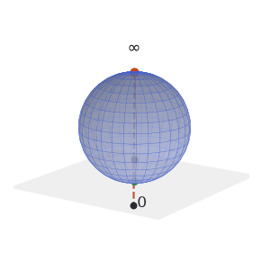

Complex projective space $\mathbb{CP}^n$ is the space of complex lines through the origin in $\mathbb{C}^{n+1}$. For $n = 1$: every line is spanned by some $(z, 1)$ except the line $(1, 0)$, so $\mathbb{CP}^1 = \mathbb{C} \cup \{\infty\}$ — the Riemann sphere, homeomorphic to $S^2$. Cell structure: one 0-cell ($\infty$) and one 2-cell ($\mathbb{C}$), nothing in between. The cellular chain complex:

$$
0 \to \underbrace{\mathbb{Z}}_{C_2} \xrightarrow{\ \partial_2\ } \underbrace{0}_{C_1} \xrightarrow{\ \partial_1\ } \underbrace{\mathbb{Z}}_{C_0} \to 0.
$$

Both boundary maps hit zero groups, so

$$
0 \to \underbrace{\mathbb{Z}}_{H_2} \xrightarrow{\ 0\ } \underbrace{0}_{H_1} \xrightarrow{\ 0\ } \underbrace{\mathbb{Z}}_{H_0} \to 0,
$$

agreeing with the hollow tetrahedron (example 5) as it must. No torsion anywhere — a preview of the general complex-projective pattern.

## Example 15: $\mathbb{CP}^2$

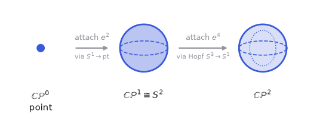

$\mathbb{CP}^2 = e^0 \cup e^2 \cup e^4$: the lines through a fixed $\mathbb{C}^2 \subset \mathbb{C}^3$ form a $\mathbb{CP}^1$, and everything else is a single 4-cell attached along the Hopf map $S^3 \to \mathbb{CP}^1$ (send each unit vector in $\mathbb{C}^2$ to its span — the fibers are circles). The cellular chain complex has cells only in even dimensions:

$$
0 \to \mathbb{Z} \xrightarrow{\ \partial_4\ } 0 \xrightarrow{\ \ }\mathbb{Z} \xrightarrow{\ \partial_2\ } 0 \xrightarrow{\ \ } \mathbb{Z} \to 0.
$$

Every boundary map has a zero group on one side or the other, so every boundary map is zero, and homology reads straight off the cells:

$$
0 \to \underbrace{\mathbb{Z}}_{H_4} \xrightarrow{\ 0\ } \underbrace{0}_{H_3} \xrightarrow{\ 0\ } \underbrace{\mathbb{Z}}_{H_2} \xrightarrow{\ 0\ } \underbrace{0}_{H_1} \xrightarrow{\ 0\ } \underbrace{\mathbb{Z}}_{H_0} \to 0,
$$

and identically for cohomology (no torsion, nothing to shift). This "cells only in even dimensions" argument computes every $\mathbb{CP}^n$ at a glance: $H_{2k} = \mathbb{Z}$ for $k \leq n$, all odd groups zero. For scale: the smallest simplicial triangulation of $\mathbb{CP}^2$ is Kühnel's famous 9-vertex complex with 36 4-simplexes, and its boundary matrices would be computing the same five groups. The interesting structure of $\mathbb{CP}^2$ — e.g. that the generator of $H^2$ squares to the generator of $H^4$ — lives in the cohomology ring, one post further than this one goes.

# Part 4: products, and a closing contrast

## Example 16: $S^1 \times S^1$ versus $S^1 \vee S^1$

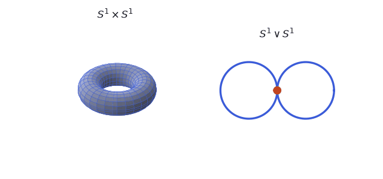

The product $S^1 \times S^1$ — pairs (point on first circle, point on second) — is the torus: one circle sweeps the tube direction, the other the hole direction. We already computed it as example 7, but it's worth recomputing structurally, because products have their own rule.

First, what does a cell structure on a product look like? Products of cells are cells: taking the circle's minimal CW structure (one 0-cell $p$, one 1-cell $e$), the product has cells $p \times p$ (dim 0), $p \times e$ and $e \times p$ (dim 1), and $e \times e$ (dim 2) — exactly the vertex, the two loops $a, b$, and the square face of the $\Delta$-complex picture. (Simplicial complexes don't multiply this cleanly — a product of simplexes is a prism, not a simplex, and must be re-triangulated; one more point for the CW column.)

The general rule is the Künneth theorem. Over a field:

$$
H_n(X \times Y) \cong \bigoplus_{i + j = n} H_i(X) \otimes H_j(Y),
$$

i.e. the Betti numbers of a product are the convolution of the factors' Betti numbers. (Over $\mathbb{Z}$ there is an extra torsion correction term — $\mathrm{Tor}(H_i, H_{j-1})$ summands — which vanishes when the factors are torsion-free, as circles are.) For the torus, with each circle contributing Betti numbers $(1, 1)$:

$$
\beta_0 = 1 \cdot 1 = 1, \qquad
\beta_1 = 1 \cdot 1 + 1 \cdot 1 = 2, \qquad
\beta_2 = 1 \cdot 1 = 1.
$$

Matching example 7. And the meaning of each term is visible: the two $H_1$ classes are (loop in one factor) × (point in the other); the $H_2$ class is (loop) × (loop) — the product of the two 1-dimensional holes is a genuinely 2-dimensional feature.

Contrast with the wedge (example 8):

| | $H_0$ | $H_1$ | $H_2$ |
| --- | --- | --- | --- |
| $S^1 \vee S^1$ | $\mathbb{Z}$ | $\mathbb{Z}^2$ | $0$ |
| $S^1 \times S^1$ | $\mathbb{Z}$ | $\mathbb{Z}^2$ | $\mathbb{Z}$ |

Wedging stacks holes side by side; multiplying makes the holes interact and spawn higher-dimensional ones. The two spaces even share $H_0$ and $H_1$, and only $H_2$ tells them apart — homology can be a close call between very different spaces. (Sharper still: $S^1 \vee S^1 \vee S^2$ has homology identical to the torus in every degree. Homology cannot distinguish them; the cup product structure on cohomology can, which is a standard motivation for caring about the ring and not just the groups.)

## Example 17: $S^2$ versus $B^3$, and invariance

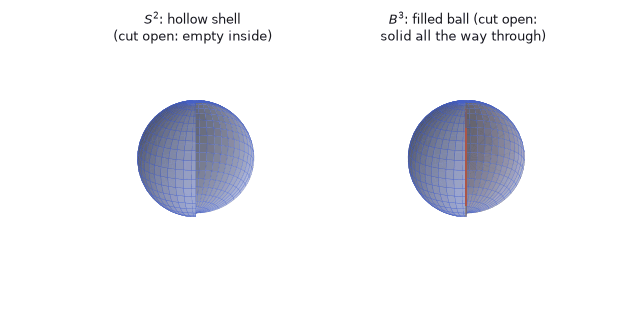

Last pairing, closing the loop with Part 1. The sphere $S^2$ and the closed solid ball $B^3$ (the filled-in sphere) are, up to homeomorphism, the hollow and solid tetrahedra of examples 5 and 6 — inflate the tetrahedron until it's round. So there is nothing new to compute:

$$
0 \to \underbrace{\mathbb{Z}}_{H_2} \xrightarrow{\ 0\ } \underbrace{0}_{H_1} \xrightarrow{\ 0\ } \underbrace{\mathbb{Z}}_{H_0} \to 0 \quad (S^2), \qquad\qquad
0 \to \underbrace{0}_{H_3} \xrightarrow{\ 0\ } \underbrace{0}_{H_2} \xrightarrow{\ 0\ } \underbrace{0}_{H_1} \xrightarrow{\ 0\ } \underbrace{\mathbb{Z}}_{H_0} \to 0 \quad (B^3).
$$

What matters here is what we did not have to compute, for two reasons. First: homology is a property of the space, not of the complex you happened to build on it. The tetrahedral shell, the icosahedral shell, the $\Delta$-complex with two triangles glued along their boundaries, the CW structure with one 0-cell and one 2-cell, and $\mathbb{CP}^1$'s cell structure all produce the same three groups for $S^2$ — we've now done several of these ourselves, and the agreement is the invariance theorem made tangible. Second: $B^3$ versus $S^2$ is the mother of all "filling kills the top class" examples, and it's worth saying once in the boundary-map language: the ball's interior 3-cell has the shell as its boundary, so the shell's cycle class dies in the ball — which is exactly the tetrahedron filtration from Part 1, at the moment $\varepsilon$ crossed $\sqrt{3/8}$. Statics and persistence are one story: a persistence pairing is just this example happening at a recorded scale.

# TDA in practice

Everything above was done by hand. This closing section connects the hand computations to what a TDA library actually executes when you feed it data — with the gridworld/exploration use case from the previous post in mind.

## Cubical complexes

Real pipelines on images, grids, and voxel data don't triangulate — they use cubical complexes, where the cells are vertices, unit edges, unit squares, unit cubes, and higher cubes, glued along faces. For a 2-D image: one vertex per pixel corner, one edge per pixel side, one square per pixel. The boundary of a square is its four edges; the boundary of an edge is its two endpoints; over $\mathbb{Z}/2$ the whole template from Part 1 runs verbatim, with "cube" in place of "simplex." (Cubes multiply better than simplexes, too — a product of cubes is a cube, so grids in any dimension come for free.) A gridworld visitation map is already a cubical complex: mark each visited cell as a filled square, include its edges and vertices, done.

It is worth being explicit that the grid is a full cell complex, not just a set of squares — the lower-dimensional cells are what the boundary maps act on. An $n \times n$ array of squares expands to a $(2n+1) \times (2n+1)$ grid of cells, interleaving vertices, edges, and squares (a $2 \times 2$ array of squares is already $9$ vertices, $12$ edges, and $4$ squares — $25$ cells). GUDHI takes filtration values on the top cells (the squares) and extends them down to the edges and vertices by the *lower-star* rule: each lower cell inherits the minimum value of the squares it touches.


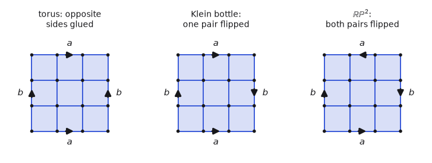

The gluing constructions from Part 2 carry over: identify opposite sides of an $n \times n$ grid and you have a cubical torus — $n^2$ squares, $2n^2$ edges, $n^2$ vertices after identification, Euler characteristic $0$ as it must be — and the same chain machinery runs on it, with squares in place of triangles ($\partial$ of a square is its four edges). Flip one pair of sides for the Klein bottle, both pairs for $\mathbb{RP}^2$. The torus case is common enough in practice that GUDHI supports it directly: `gudhi.PeriodicCubicalComplex(top_dimensional_cells=grid, periodic_dimensions=[True, True])` runs persistence on the grid with wraparound gluing. The flipped identifications are not periodic in that sense, so the Klein bottle and $\mathbb{RP}^2$ need a general cell complex rather than the cubical fast path.

Filtrations arise by sublevel sets of a function on the top cells: assign each pixel/cell a value (intensity, distance, $-$visit count, ...), let $K_t$ be the complex built from cells with value $\leq t$, and sweep $t$. In [GUDHI](https://gudhi.inria.fr/), the whole construction is:

```python
import gudhi
import numpy as np

grid = np.array([[0.2, 0.9, 0.3],
                 [0.4, 1.0, 0.1],
                 [0.2, 0.8, 0.4]])   # e.g. -normalized visit counts

cc = gudhi.CubicalComplex(top_dimensional_cells=grid)
diagram = cc.persistence(homology_coeff_field=2)  # list of (dim, (birth, death))
print(cc.betti_numbers())
```

For point clouds and Vietoris–Rips, the object is a simplex tree (GUDHI's data structure for filtered simplicial complexes — a trie whose paths are simplices, letting insertion and face lookups run without materializing boundary matrices until needed):

```python
rips = gudhi.RipsComplex(distance_matrix=D, max_edge_length=2.0)
st = rips.create_simplex_tree(max_dimension=2)   # simplices up to triangles
diagram = st.persistence(homology_coeff_field=2)
st.persistence_intervals_in_dimension(1)          # the H1 (birth, death) pairs
```

## From the complex to the matrix

Whatever the complex, the library's next step is the one we've been doing all along: a boundary matrix. One matrix $D$ for the whole filtration, columns and rows indexed by all cells of all dimensions, ordered by birth value (ties broken by dimension, so faces precede cofaces); $D[i, j] = 1$ iff cell $i$ is a codimension-one face of cell $j$. This is the block-assembly of every $\partial_k$ from our template into a single upper-triangular matrix — the same object as the hollow-triangle-with-a-schedule example in the previous post.

Concretely, take the square filtration from Part 1. Its full cell list, in birth order with dimension breaking ties:

| cells | $a, b, c, d$ | $ab, bc, cd, da$ | $ac, bd$ | $abc, abd, acd, bcd$ | $abcd$ |
| --- | --- | --- | --- | --- | --- |
| birth $\varepsilon$ | $0$ | $0.5$ | $\sqrt{2}/2$ | $\sqrt{2}/2$ | $\sqrt{2}/2$ |

(15 cells — at $\sqrt{2}/2$ the diagonals, the triangles, and the solid tetrahedron all arrive, since VR adds every subset whose pairwise distances fit.) The filtered boundary matrix, with dots for zeros:

$$
D \;=\; \begin{array}{c|ccccccccccccccc}
& a & b & c & d & ab & bc & cd & da & ac & bd & abc & abd & acd & bcd & abcd \\ \hline
a & \cdot & \cdot & \cdot & \cdot & 1 & \cdot & \cdot & 1 & 1 & \cdot & \cdot & \cdot & \cdot & \cdot & \cdot \\
b & \cdot & \cdot & \cdot & \cdot & 1 & 1 & \cdot & \cdot & \cdot & 1 & \cdot & \cdot & \cdot & \cdot & \cdot \\
c & \cdot & \cdot & \cdot & \cdot & \cdot & 1 & 1 & \cdot & 1 & \cdot & \cdot & \cdot & \cdot & \cdot & \cdot \\
d & \cdot & \cdot & \cdot & \cdot & \cdot & \cdot & 1 & 1 & \cdot & 1 & \cdot & \cdot & \cdot & \cdot & \cdot \\
ab & \cdot & \cdot & \cdot & \cdot & \cdot & \cdot & \cdot & \cdot & \cdot & \cdot & 1 & 1 & \cdot & \cdot & \cdot \\
bc & \cdot & \cdot & \cdot & \cdot & \cdot & \cdot & \cdot & \cdot & \cdot & \cdot & 1 & \cdot & \cdot & 1 & \cdot \\
cd & \cdot & \cdot & \cdot & \cdot & \cdot & \cdot & \cdot & \cdot & \cdot & \cdot & \cdot & \cdot & 1 & 1 & \cdot \\
da & \cdot & \cdot & \cdot & \cdot & \cdot & \cdot & \cdot & \cdot & \cdot & \cdot & \cdot & 1 & 1 & \cdot & \cdot \\
ac & \cdot & \cdot & \cdot & \cdot & \cdot & \cdot & \cdot & \cdot & \cdot & \cdot & 1 & \cdot & 1 & \cdot & \cdot \\
bd & \cdot & \cdot & \cdot & \cdot & \cdot & \cdot & \cdot & \cdot & \cdot & \cdot & \cdot & 1 & \cdot & 1 & \cdot \\
abc & \cdot & \cdot & \cdot & \cdot & \cdot & \cdot & \cdot & \cdot & \cdot & \cdot & \cdot & \cdot & \cdot & \cdot & 1 \\
abd & \cdot & \cdot & \cdot & \cdot & \cdot & \cdot & \cdot & \cdot & \cdot & \cdot & \cdot & \cdot & \cdot & \cdot & 1 \\
acd & \cdot & \cdot & \cdot & \cdot & \cdot & \cdot & \cdot & \cdot & \cdot & \cdot & \cdot & \cdot & \cdot & \cdot & 1 \\
bcd & \cdot & \cdot & \cdot & \cdot & \cdot & \cdot & \cdot & \cdot & \cdot & \cdot & \cdot & \cdot & \cdot & \cdot & 1 \\
abcd & \cdot & \cdot & \cdot & \cdot & \cdot & \cdot & \cdot & \cdot & \cdot & \cdot & \cdot & \cdot & \cdot & \cdot & \cdot
\end{array}
$$

The nonzero pattern is the $\partial_1$, $\partial_2$, $\partial_3$ blocks of our template, interleaved in birth order: columns $ab$ through $bd$ carry the edge boundaries (vertices as rows), columns $abc$ through $bcd$ carry the triangle boundaries (edges as rows), and column $abcd$ carries the solid's boundary (triangles as rows). Faces always precede cofaces, so everything sits above the diagonal.

## The reduction, and reading everything off

Persistence is computed by the standard reduction: process columns left to right, and while a column shares its lowest nonzero row with an earlier column, add that earlier column into it (over $\mathbb{Z}/2$, XOR):

```python
def reduce(D):                      # D: list of columns as sorted int sets
    low_inv = {}                    # lowest row -> column index
    V = [ {j} for j in range(len(D)) ]   # track the column operations
    for j in range(len(D)):
        while D[j] and max(D[j]) in low_inv:
            k = low_inv[max(D[j])]
            D[j] ^= D[k]            # symmetric difference = mod-2 addition
            V[j] ^= V[k]
        if D[j]:
            low_inv[max(D[j])] = j
    return D, V, low_inv
```

**What the loop is actually doing.** Under the hood this is Gaussian elimination over $\mathbb{Z}/2$ (binary arithmetic, where $1 + 1 = 0$), specialized so the birth–death pairing can be read straight off the result. Three ideas carry it.

*Columns as sets.* A column over $\mathbb{Z}/2$ is determined by the rows where it has a $1$, so each column is stored as a set of row indices — nothing else. Adding two columns mod $2$ is then just symmetric difference (`^` on Python sets): a row present in both cancels, a row in one survives.

```
column A = {2, 3}        column B = {2, 4}

A ⊕ B :   row 2 in both   → cancels
          row 3 in A only → stays
          row 4 in B only → stays
        = {3, 4}
```

That single symmetric difference is one elimination step.

*The pivot `low`.* For a nonzero column, $\mathrm{low}$ is its largest row index — the lowest $1$ when rows increase upward, which is `max(D[j])` in the code. The entire goal of the reduction is a matrix in which no two columns share a $\mathrm{low}$; a column that still collides with an earlier one is not yet reduced.

*The lookup `low_inv`.* Instead of scanning all earlier columns for a collision, the algorithm keeps a dictionary $\mathrm{low} \mapsto (\text{the column that owns it})$. When column $j$'s current lowest $1$ is already taken, `low_inv` names the owner $k$ in one step and we add it in, $D_j \leftarrow D_j \oplus D_k$. Since $k$ has its $1$ in that same lowest row, the XOR cancels it, so $\mathrm{low}(D_j)$ jumps strictly *upward*: a pivot at row $7$ becomes $5$, then $2$, and so on. The `while` loop is exactly this climb, and it ends one of two ways — the pivot lands on a row nobody owns (a new pivot, recorded in `low_inv`), or the column empties out entirely (its cells summed to a boundaryless chain — a cycle, so a class is born).

**Why `V` is worth carrying.** Every time the code does `D[j] ^= D[k]` it also does `V[j] ^= V[k]`. Starting from $V_j = \{j\}$, this records which *original* columns were summed to make the current one — the change of basis $R = D V$. It contributes nothing to the pairs, but it is exactly what recovers a representative: when a column reduces to zero, $V_j$ is the set of original simplices whose boundaries cancelled, i.e. the cycle itself. (This is the $V$ that `representative_cycles` reads off later.)

This is the persistence algorithm of Edelsbrunner, Letscher, and Zomorodian. What sets it apart from textbook Gaussian elimination is only that the arithmetic is over $\mathbb{Z}/2$ (so addition is XOR), columns are stored sparsely as row-index sets, and elimination runs strictly left to right — which is what makes the birth–death pairing readable straight off the reduced matrix.

The output encodes everything this post computed, all at once:

- Pairs. A nonzero reduced column $j$ with lowest entry $i$ pairs the births of cells $i$ and $j$: cell $i$ created a class, cell $j$ killed it — one point $(\mathrm{birth}(i), \mathrm{birth}(j))$ in the persistence diagram, in dimension $\dim(i)$. Zero columns whose index is never a "lowest entry" are the essential classes (death $= \infty$).
- Homology groups. The Betti numbers at any scale $t$: count pairs whose interval contains $t$, per dimension. Freeze the filtration at its end and you recover the static $H_*$ of the final complex — the reduction subsumes all the rank computations of Parts 1–4.
- Representatives. The tracking matrix $V$ records which original columns were summed: when reduced column $j$ is zero, $V[j]$ lists a cycle (a sum of cells whose boundary vanishes) representing the class born at $j$ — the algorithmic version of our "spanned by $ab + bc + ca$" statements, and the object you'd hand to an exploration agent as "here is the ring of states around the unexplored pocket."

Run it on the $15 \times 15$ matrix above and the filtration section's answers fall out mechanically. Columns $ab$, $bc$, $cd$ keep lowest 1's in rows $b$, $c$, $d$: three component deaths at $0.5$. Column $da$ reduces to zero (add $cd$, then $bc$, then $ab$): the loop is born. Columns $ac$ and $bd$ also reduce to zero — two more cycles, born at $\sqrt{2}/2$ — and the triangle columns kill all three: $abc$ pairs with row $ac$ and $abd$ with row $bd$ (both zero-lifetime), while $acd$, after one addition of column $abc$, has its lowest 1 in row $da$ and kills the loop: the pair $(0.5,\ \sqrt{2}/2)$. Finally $bcd$ reduces to zero (the momentary shell) and $abcd$ kills it at birth. Every pair matches the square's persistence diagram from Part 1.

The reduction is $O(m^3)$ worst case in the number of cells $m$ but nearly linear in practice with the standard optimizations (clearing/twist, cohomology-side reduction). On that last point: as mentioned in the previous post, serious implementations (Ripser, GUDHI's persistent cohomology) run the dual computation — reduce the coboundary matrix instead — which produces the same persistence pairs, typically much faster (the intuition: cohomology processes the filtration in the direction where columns stay sparse). Everything in this post about transposes is also the reason that's legitimate: over a field the pairs agree, and the cocycle representatives it returns are the hole detectors of examples 3 and 8 — which for applications like circular coordinates are exactly what you want anyway.

## Representatives, thresholds, and cost

For exploration we don't just want to know a loop exists — we want the cells it runs through, so we can steer an agent onto them. Two practical points: extract representatives only for the classes worth keeping, and be deliberate about how high a dimension you compute.

Start with what the persistence run hands back for free. Each class comes with its *birth* and *death* simplices — for an $H_1$ loop, the edge that closed it and the triangle that later filled it. Filter to the long bars, then read those off. In GUDHI:

```python
st.persistence(homology_coeff_field=2)

# keep only the H1 loops that persist at least tau -- long bars, not noise
H1 = st.persistence_intervals_in_dimension(1)      # (birth, death) rows
tau = 0.3
long_loops = H1[(H1[:, 1] - H1[:, 0]) >= tau]

pairs = st.persistence_pairs()            # per class: (birth simplex, death simplex)
gens  = st.flag_persistence_generators()  # flag complex: witnessing vertices/edges
```

The birth edge, though, is not the loop — it is one edge, the last to arrive, and `persistence_pairs()` and `flag_persistence_generators()` return only it (plus the death triangle). That gives a point *on* the loop, enough to know roughly where the hole is, but not the ring of cells around it.

The ring lives in the reduction. When a creator column reduces to zero, the record of which columns were summed to zero it out — the column $V_i$ of the tracking matrix from the reduction above — is a chain whose boundary vanishes: a cycle, and for an $H_1$ creator it is exactly the loop of edges. GUDHI's default (cohomology) path doesn't expose $V$, so to recover cycles you run the homology-side reduction keeping the column tracking. It is a short extension of the reduction we already wrote:

```python
# birth[i] : birth scale of cell i;  dim[i] : its dimension (1 for edges)
R, V, low_inv = reduce(D)          # R[i] empty  <=>  cell i creates a class

def representative_cycles(R, V, birth, dim, tau):
    # a nonzero reduced column j destroys the class created at row low(j)
    destroyer = {max(R[j]): j for j in range(len(R)) if R[j]}
    cycles = []
    for i in range(len(R)):
        if R[i] or dim[i] != 1:        # keep only H1 creators (empty edge columns)
            continue
        j = destroyer.get(i)           # the triangle that fills the loop, if any
        death = birth[j] if j is not None else float("inf")
        if death - birth[i] >= tau:    # long-lived bar only
            cycles.append((birth[i], death, V[i]))   # V[i] = the ring of edges
    return cycles
```

The final line is the key step: an edge column `i` with `R[i]` empty is an $H_1$ creator, and because it reduced to zero, $\partial V_i = 0$ — so `V[i]` is a closed cycle, the entire ring of edges around the hole (birth edge included), not just the one edge `persistence_pairs()` reports.

Two caveats. The cycle $V_i$ is *a* representative, not a canonical one — some loop homologous to the hole, not necessarily the shortest; tightening it to a minimal loop is a separate optimization (and over $\mathbb{Z}/2$ can be hard). And extracting it stays cheap only because you threshold first: you build $V_i$ for the few bars that cleared $\tau$, never for the $O(m)$ short-lived classes that are sampling noise.

The cost knob to respect is the maximum dimension. Computing homology up to dimension $d$ requires every simplex up to dimension $d+1$ (you need the $(d+1)$-simplices to kill the $d$-cycles), and for $N$ points a Vietoris–Rips complex has $\binom{N}{k+1}$ simplices of dimension $k$. So the simplex count — and with it the runtime — grows like

$$
\sum_{k=0}^{d+1} \binom{N}{k+1} \;=\; O\!\left(N^{\,d+2}\right),
$$

each extra dimension multiplying the work by roughly another factor of $N$. Concretely: $H_0$ and $H_1$ need only vertices, edges, and triangles ($O(N^3)$); reaching $H_2$ pulls in every tetrahedron ($O(N^4)$); $H_3$ every $4$-simplex ($O(N^5)$). This is why `create_simplex_tree(max_dimension=2)` is the usual default — for flat gridworlds $H_0$ and $H_1$ carry essentially all the signal, and they are the cheap ones. Ask for one dimension more than the feature you actually need, and no further.

One last property, and a useful one: persistence also measures the size of the hole. For a loop enclosing a void of radius $r$, sampled densely, the $H_1$ class is born near $\varepsilon = 0$ (the sample gaps close early) and dies around $\varepsilon \approx r$ — the scale at which balls of that radius finally cover the enclosed disk and the loop bounds. So the death scale, and hence the persistence (death $-$ birth), is proportional to the radius of the hole:

$$
\text{persistence} \;\approx\; \text{death} \;\propto\; r.
$$

The bar length is not just a confidence score separating signal from noise — it is a measurement of how big the void is. That makes persistence a ready-made scalar feature: a small sealed chamber and a large one both register as a single $H_1$ class, but their bar lengths tell them apart, and that number can go straight into a controller's state or an exploration bonus alongside the representative cycle that says where the hole is.

This is the same template throughout: point, segment, triangle, tetrahedron, torus, Klein bottle, projective spaces, and products were all worked with the same six steps. Assembled into one filtered boundary matrix and reduced, that template is exactly what runs when you call `persistence()` on your own data.

## Computing torsion

Everything the code computed ran over $\mathbb{Z}/2$, and $\mathbb{Z}/2$ is a field — so it returns Betti numbers and never the torsion we found by hand for the Klein bottle ($H_1 = \mathbb{Z} \oplus \mathbb{Z}/2$) and $\mathbb{RP}^2$ ($H_1 = \mathbb{Z}/2$). That is a fact about field coefficients, not a limitation of GUDHI: over a field the chain and homology groups are vector spaces, and a vector space is free — it has no torsion. Recovering torsion takes more work, and it is worth seeing how, because the difference is not academic.

Recall from Example 10 that over $\mathbb{Z}/2$ the Klein bottle and the torus have the same homology, $(\beta_0, \beta_1, \beta_2) = (1, 2, 1)$; the torsion is the only thing separating them. Here are the Betti numbers of the four closed surfaces obtained by gluing a square's edges in pairs, over three coefficient rings:

| space | $\mathbb{Z}/2$ | $\mathbb{Z}/3$ | $\mathbb{Q}$ |
| --- | --- | --- | --- |
| $S^2$ | $(1,0,1)$ | $(1,0,1)$ | $(1,0,1)$ |
| $T^2$ | $(1,2,1)$ | $(1,2,1)$ | $(1,2,1)$ |
| Klein bottle | $(1,2,1)$ | $(1,1,0)$ | $(1,1,0)$ |
| $\mathbb{RP}^2$ | $(1,1,1)$ | $(1,0,0)$ | $(1,0,0)$ |

Two things to read off it. The torsion-free spaces, $S^2$ and $T^2$, give the same numbers over every field. The spaces carrying $\mathbb{Z}/2$ torsion — the Klein bottle and $\mathbb{RP}^2$ — each lose a Betti number as you move off the prime $2$: the Klein bottle's $\beta_1$ drops from $2$ to $1$, and $\mathbb{RP}^2$'s from $1$ to $0$. That drop is the $\mathbb{Z}/2$ summand, visible over $\mathbb{Z}/2$ and gone over $\mathbb{Z}/3$.

Note also which pair is actually hard. Over $\mathbb{Z}/2$ the Klein bottle and $\mathbb{RP}^2$ already differ ($\beta_1 = 2$ versus $1$), so $\mathbb{Z}/2$ alone tells the careful reader those two apart. The pair $\mathbb{Z}/2$ cannot separate is the Klein bottle and the torus — both $(1,2,1)$ — which is precisely the ambiguity torsion resolves.

The practical way to detect it is to compare a few prime fields. Run the field computation over $\mathbb{Z}/2, \mathbb{Z}/3, \dots$ and watch the Betti numbers exactly as in the table: wherever $\beta$ drops as you leave a prime $p$, there is $p$-torsion. This is the same fast field reduction, and GUDHI can compute several fields in one pass (the multi-field algorithm of Boissonnat and Maria).

```python
for p in (2, 3, 5):
    st.compute_persistence(homology_coeff_field=p, persistence_dim_max=True)
    print(p, st.betti_numbers())
# torus : identical at every p            -> torsion-free
# klein : (1,2,1) at p=2, (1,1,0) at p=3  -> the drop is Z/2-torsion
```

It reports which primes divide the torsion coefficients, though not the full group — telling $\mathbb{Z}/4$ from $\mathbb{Z}/2 \oplus \mathbb{Z}/2$ needs more than knowing $2$ divides the order. In practice the first few primes are enough: almost all torsion in sampled data is $\mathbb{Z}/2$, from non-orientable pieces such as a Klein bottle or projective plane sitting inside a point cloud, and $\{2, 3\}$ catches essentially everything that arises naturally. One can construct a complex with $\mathbb{Z}/101$ torsion, and then testing $\{2, 3, 5\}$ would miss it — the diagrams agree across all three — but that is a synthetic object, not something sampled data produces.

The exact torsion group, when you want it, comes from integer homology: the Smith normal form of the integer boundary matrices, which is the method of Examples 10 and 12 and what `SimplicialComplex(...).homology()` returns in SageMath ($\mathbb{Z} \oplus \mathbb{Z}/2$ for the Klein bottle, torsion and all). But Smith normal form over $\mathbb{Z}$ does not reduce to fast field rank, does not parallelize the way field reduction does, and its intermediate integers can grow large — so it does not scale to the large complexes this program will eventually work with. We will stay with prime-field comparison and not compute integer homology.

---

## References

- A. Hatcher, [*Algebraic Topology*](https://pi.math.cornell.edu/~hatcher/AT/ATpage.html), Cambridge University Press, 2002. Free online. $\Delta$-complexes and simplicial homology §2.1, cellular homology and projective spaces §2.2, Künneth §3.B, universal coefficients §3.1.
- J. Munkres, *Elements of Algebraic Topology*, Addison–Wesley, 1984. The classical simplicial treatment, including Smith normal form for integer homology.
- H. Edelsbrunner and J. Harer, *Computational Topology: An Introduction*, AMS, 2010. The boundary-matrix reduction, cubical and Čech/VR pipelines.
- H. Edelsbrunner, D. Letscher, and A. Zomorodian, "Topological Persistence and Simplification," *Discrete & Computational Geometry* 28 (2002), 511–533. The original left-to-right boundary-matrix reduction — the algorithm walked through above.
- A. Zomorodian and G. Carlsson, "Computing Persistent Homology," *Discrete & Computational Geometry* 33 (2005), 249–274. The persistence algorithm recast in the language of graded modules, with its correctness proof.
- V. de Silva, D. Morozov, and M. Vejdemo-Johansson, "Dualities in Persistent (Co)homology," *Inverse Problems* 27 (2011), 124003. Why persistent cohomology gives the same diagrams, and the circular-coordinates application.
- U. Bauer, "Ripser: Efficient Computation of Vietoris–Rips Persistence Barcodes," *Journal of Applied and Computational Topology* 5 (2021), 391–423. The cohomology-side reduction and the clearing optimization in practice.
- J.-D. Boissonnat and C. Maria, "Computing Persistent Homology with Various Coefficient Fields in a Single Pass," in *Algorithms — ESA 2014*, LNCS 8737, 185–196. The multi-field reduction used to detect torsion primes.
- The GUDHI Project, [*GUDHI User and Reference Manual*](https://gudhi.inria.fr/doc/latest/). Cubical complexes, simplex trees, and the persistence API used above.
- D. W. Walkup, "The lower bound conjecture for 3- and 4-manifolds," *Acta Mathematica* 125 (1970), 75–107 (presented at the 1969 Calgary conference on combinatorial structures). Establishes that the vertex-minimal triangulation of $\mathbb{RP}^3$ has 11 vertices and classifies them.
- W. Kühnel and T. F. Banchoff, "The 9-Vertex Complex Projective Plane," *The Mathematical Intelligencer* 5 (1983), 11–22. The minimal triangulation of $\mathbb{CP}^2$.
- N. Otter, M. A. Porter, U. Tillmann, P. Grindrod, and H. A. Harrington, "A Roadmap for the Computation of Persistent Homology," *EPJ Data Science* 6 (2017), article 17. Survey of software and algorithmic optimizations.
- The previous post in this series, [*Basic Topology and Symmetric Simplexes*](/blog/basic_topology_and_symmetric_simplexes), for the Čech/VR complexes, the nerve lemma, the sandwich theorem, and the exploration use case.
